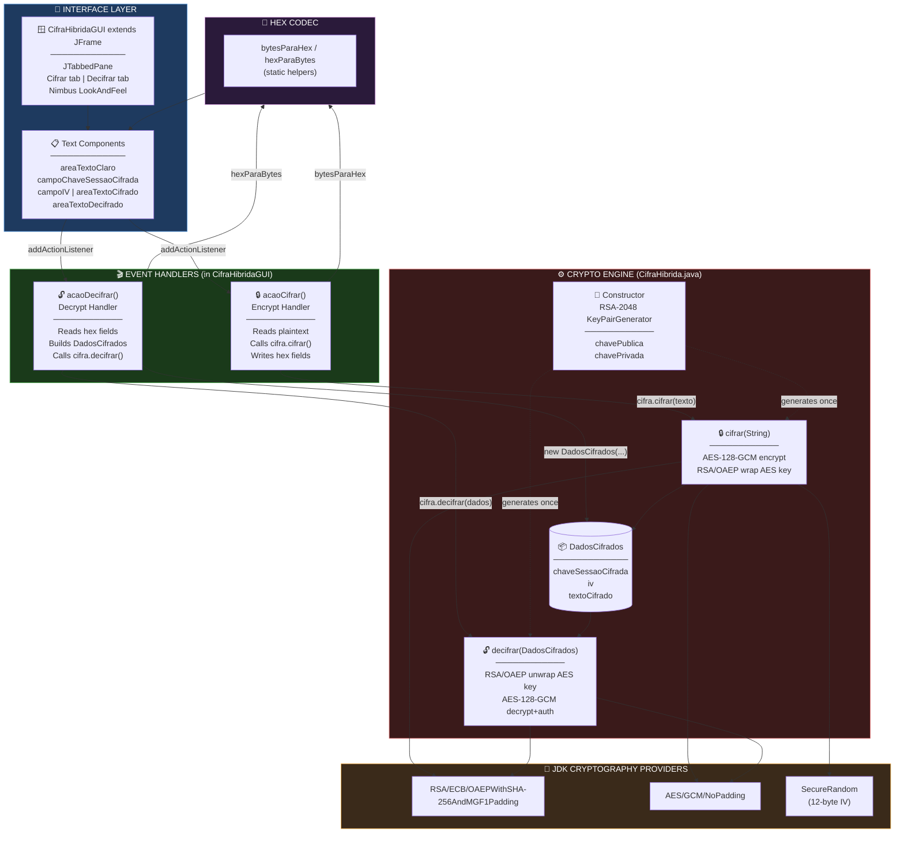
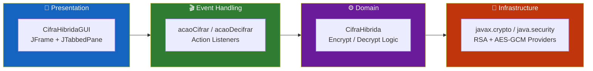
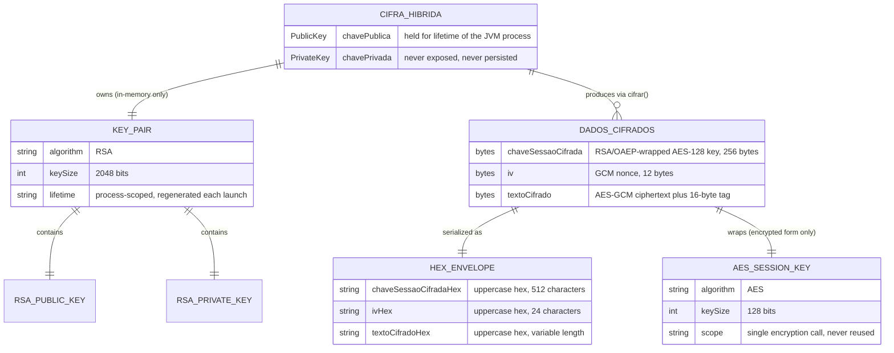
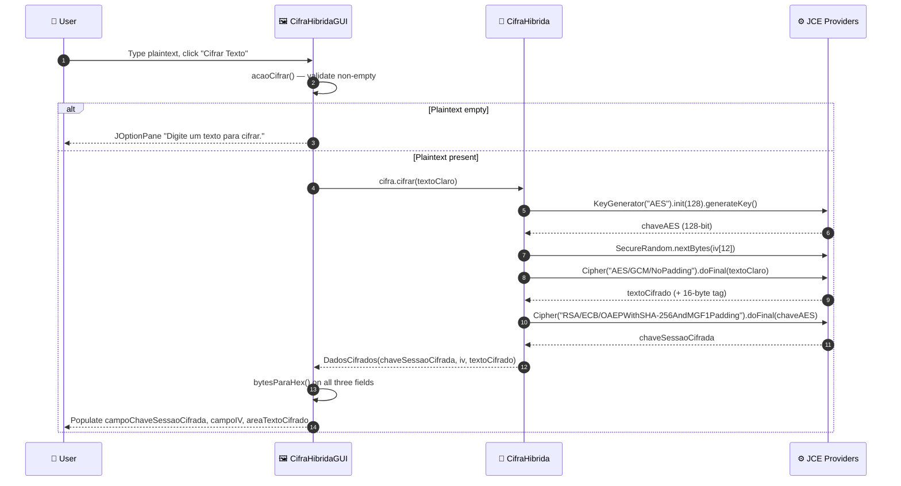
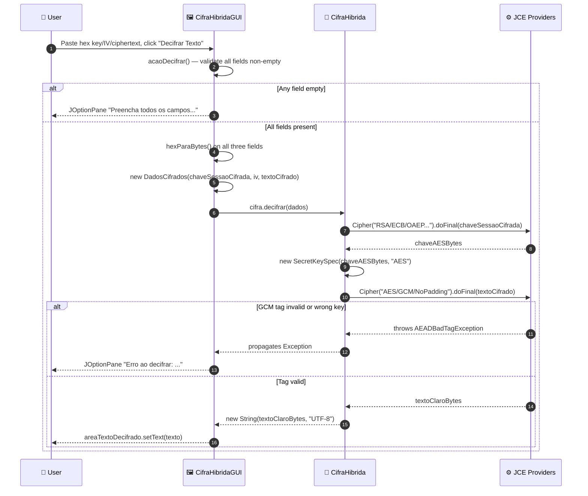
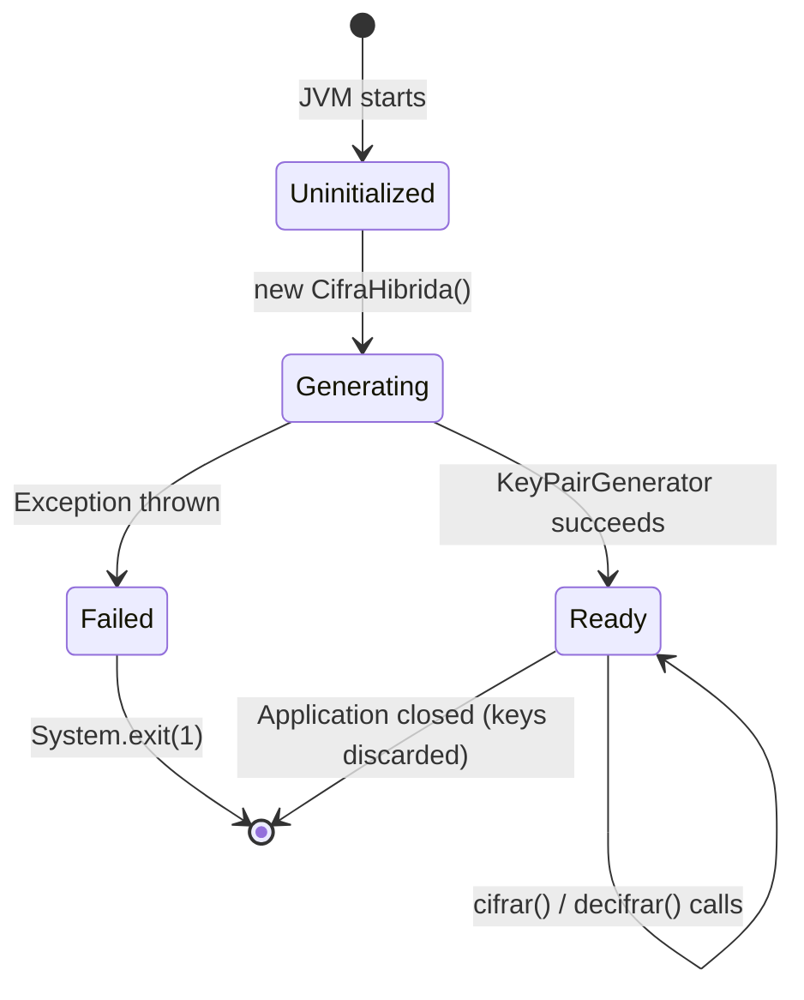
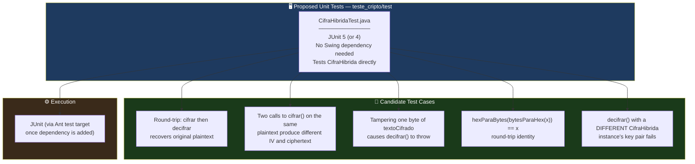

<div align="center">

**🌐 Choose Language / Selecione o Idioma / Elija el Idioma**

[](README.md)&nbsp;&nbsp;&nbsp;[](README_PT.md)&nbsp;&nbsp;&nbsp;[](README_ES.md)

</div>

---

<div align="center">

```
 ██████╗██╗███████╗██████╗  █████╗ 
██╔════╝██║██╔════╝██╔══██╗██╔══██╗
██║     ██║█████╗  ██████╔╝███████║
██║     ██║██╔══╝  ██╔══██╗██╔══██║
╚██████╗██║██║     ██║  ██║██║  ██║
 ╚═════╝╚═╝╚═╝     ╚═╝  ╚═╝╚═╝  ╚═╝
   Hybrid RSA-2048 + AES-128-GCM Encryption Desktop Application
```

---

[](https://openjdk.org/)
[](https://docs.oracle.com/javase/tutorial/uiswing/)
[](https://netbeans.apache.org/)
[]()
[]()
[]()
[]()

<br/>

> **A native Java Swing desktop application demonstrating hybrid cryptography**
> combining RSA-2048 asymmetric key exchange with AES-128-GCM authenticated symmetric encryption.

<br/>


-B71C1C?style=flat-square)

</div>

---

## 📑 Table of Contents

<details>
<summary>▶️ <strong>Click to expand / collapse this section</strong></summary>

<table>
<tr>
<td valign="top" width="50%">

**🏗️ System**
- [Overview](#-overview)
- [System Architecture](#-system-architecture)
- [Technology Stack](#-technology-stack)
- [Design Patterns](#-design-patterns-applied)
- [Project Structure](#-project-structure)

**📦 Modules**
- [CifraHibrida — Crypto Engine](#-cifrahibrida--hybrid-crypto-engine)
- [DadosCifrados — Ciphertext Container](#-dadoscifrados--ciphertext-container)
- [CifraHibridaGUI — Swing Interface](#-cifrahibridagui--swing-interface)
- [Hex Codec Helpers](#-hex-codec-helpers)

</td>
<td valign="top" width="50%">

**💼 Business**
- [Business Rules](#-business-rules)
- [Functional Requirements](#-functional-requirements)
- [Non-Functional Requirements](#-non-functional-requirements)

**📐 Design**
- [Data Model](#-data-model)
- [System Flows](#-system-flows)
- [Encrypt Flow](#encrypt-flow)
- [Decrypt Flow](#decrypt-flow)
- [GUI Event Flow](#gui-event-flow)

**🔐 Security & Ops**
- [Security](#-security)
- [Installation & Execution](#-installation--execution)
- [Automated Tests](#-automated-tests)
- [Metrics & Monitoring](#-metrics--monitoring)
- [Known Limitations](#-known-limitations)

</td>
</tr>
</table>

---

</details>

## 🌟 Overview

<details>
<summary>▶️ <strong>Click to expand / collapse this section</strong></summary>

**CifraHibrida** (`teste_cripto`) is a small, self-contained Java Swing desktop application that demonstrates the **hybrid encryption** pattern used by real-world protocols such as TLS and PGP: a fast **symmetric cipher** (AES-128 in GCM mode) protects the actual message, while a **slow but key-exchange-friendly asymmetric cipher** (RSA-2048) protects the one-time symmetric key. Every identifier in the source, from class names to variable names, is written in Portuguese, reflecting the project's origin as an educational cryptography exercise.

The application has exactly two classes. `CifraHibrida.java` is the cryptographic engine: it generates an RSA-2048 key pair on construction, exposes a `cifrar()` (encrypt) method that produces an AES-encrypted ciphertext plus an RSA-wrapped AES session key, and a `decifrar()` (decrypt) method that reverses the process. `CifraHibridaGUI.java` is a `JFrame`-based Swing interface with two tabs, "Cifrar" (Encrypt) and "Decifrar" (Decrypt), that lets a user type plaintext, encrypt it, and see the three resulting byte arrays (session key, IV, ciphertext) rendered as hexadecimal text, or paste hexadecimal values back in to decrypt them.

There is **no database, no network socket, and no file persistence** anywhere in the code. The RSA key pair lives only in the `CifraHibrida` object's memory for the lifetime of the running JVM process; closing the application discards it irrecoverably. This is a deliberate, if unstated, design choice inherent to the small teaching scope of the project, and it is documented honestly throughout this README, particularly in [Security](#-security) and [Known Limitations](#-known-limitations).

### 🎯 System Objectives

| Objective | Description |
|-----------|-------------|
| 🔑 **Key Pair Generation** | Generate a fresh RSA-2048 key pair every time the application starts, via `KeyPairGenerator` |
| 🔒 **Symmetric Encryption** | Encrypt arbitrary UTF-8 plaintext with a freshly generated 128-bit AES key in GCM mode |
| 🎁 **Key Wrapping** | Encrypt (wrap) the one-time AES key with the RSA public key using OAEP padding |
| 🔓 **Decryption Round-Trip** | Unwrap the AES key with the RSA private key, then decrypt and authenticate the ciphertext |
| 🔡 **Human-Readable Transport** | Encode every cryptographic byte array (key, IV, ciphertext) as uppercase hexadecimal text |
| 🖼️ **Interactive Demonstration** | Provide a two-tab Swing GUI so a user can encrypt and decrypt without writing code |
| 🎨 **Native Look and Feel** | Use the Nimbus `LookAndFeel` for a modern desktop appearance |
| 📦 **Zero External Dependencies** | Rely exclusively on the JDK's built-in `java.security` and `javax.crypto` APIs |

---

</details>

## 🏗️ System Architecture

<details>
<summary>▶️ <strong>Click to expand / collapse this section</strong></summary>

### Module Diagram



### Architecture Layers



---

</details>

## 🛠️ Technology Stack

<details>
<summary>▶️ <strong>Click to expand / collapse this section</strong></summary>

<table>
<thead>
<tr>
<th>Layer</th>
<th>Technology</th>
<th>Version</th>
<th>Purpose</th>
</tr>
</thead>
<tbody>
<tr>
<td rowspan="2"><strong>🧠 Language</strong></td>
<td>Java</td>
<td>17 (<code>javac.source</code> / <code>javac.target</code>)</td>
<td>Application source and target bytecode level</td>
</tr>
<tr>
<td>UTF-8</td>
<td><code>source.encoding</code></td>
<td>Source file and plaintext string encoding</td>
</tr>
<tr>
<td rowspan="2"><strong>🖼️ UI Toolkit</strong></td>
<td>Java Swing</td>
<td>JDK-bundled</td>
<td><code>JFrame</code>, <code>JTabbedPane</code>, <code>JTextArea</code>, <code>JTextField</code>, <code>JButton</code></td>
</tr>
<tr>
<td>Nimbus LookAndFeel</td>
<td>JDK-bundled</td>
<td>Modern cross-platform theme applied via <code>UIManager</code></td>
</tr>
<tr>
<td rowspan="2"><strong>🔐 Asymmetric Crypto</strong></td>
<td>RSA</td>
<td>2048-bit</td>
<td><code>KeyPairGenerator</code> / <code>Cipher</code> — session-key wrapping</td>
</tr>
<tr>
<td>OAEP Padding</td>
<td>SHA-256 + MGF1</td>
<td><code>RSA/ECB/OAEPWithSHA-256AndMGF1Padding</code> transformation</td>
</tr>
<tr>
<td rowspan="2"><strong>🔒 Symmetric Crypto</strong></td>
<td>AES</td>
<td>128-bit</td>
<td><code>KeyGenerator</code> / <code>Cipher</code> — message encryption</td>
</tr>
<tr>
<td>GCM Mode</td>
<td>128-bit auth tag, 12-byte IV</td>
<td><code>AES/GCM/NoPadding</code> — confidentiality + integrity in one pass</td>
</tr>
<tr>
<td><strong>🎲 Randomness</strong></td>
<td>SecureRandom</td>
<td>JDK-bundled</td>
<td>Cryptographically secure IV generation</td>
</tr>
<tr>
<td><strong>🔡 Encoding</strong></td>
<td>Custom Hex Codec</td>
<td>—</td>
<td><code>bytesParaHex</code> / <code>hexParaBytes</code> static helpers, no external library</td>
</tr>
<tr>
<td rowspan="2"><strong>🔧 Build</strong></td>
<td>Apache Ant</td>
<td>NetBeans-generated (<code>build-impl.xml</code>)</td>
<td>Compile, run, jar, test, clean lifecycle</td>
</tr>
<tr>
<td>NetBeans Project Model</td>
<td><code>org.netbeans.modules.java.j2seproject</code></td>
<td>IDE metadata in <code>nbproject/</code></td>
</tr>
</tbody>
</table>

---

</details>

## 🎨 Design Patterns Applied

<details>
<summary>▶️ <strong>Click to expand / collapse this section</strong></summary>

| Pattern | Where | Rationale |
|---------|-------|-----------|
| 🎁 **Envelope Encryption (Hybrid Cryptosystem)** | `CifraHibrida.cifrar()` / `decifrar()` | The bulk message is encrypted with fast AES; only the small AES key is encrypted with slow RSA |
| 📦 **Value Object / DTO** | `CifraHibrida.DadosCifrados` (static nested class) | Immutable-by-convention carrier for the three ciphertext components, with only getters |
| 🧩 **Static Nested Class** | `DadosCifrados` declared inside `CifraHibrida` | Groups the ciphertext shape with the engine that produces and consumes it |
| 🧭 **Facade** | `cifrar(String)` / `decifrar(DadosCifrados)` | Two one-call methods hide key generation, IV generation, GCM parameter setup and RSA wrapping |
| 🎬 **Observer / Callback (Lambda Listener)** | `botaoCifrar.addActionListener(e -> acaoCifrar())` | Swing event-driven reaction to button clicks |
| 🔡 **Codec / Translator** | `bytesParaHex` / `hexParaBytes` | Converts between the binary domain of `javax.crypto` and the text domain of `JTextArea` |
| 🚦 **Guard Clause** | `if (textoClaro == null \|\| textoClaro.isEmpty())` in `acaoCifrar()` | Early return keeps the happy path in the handler flat |
| 🏗️ **Static Factory via Constructor** | `new CifraHibrida()` throws checked `Exception` | Key-pair generation is inseparable from object construction, forcing callers to handle failure immediately |

---

</details>

## 📁 Project Structure

<details>
<summary>▶️ <strong>Click to expand / collapse this section</strong></summary>

```
programa_criptografico_chaves/
│
├── 📄 README.md                          # 🇺🇸 English (primary)
├── 📄 README_PT.md                       # 🇧🇷 Português
├── 📄 README_ES.md                       # 🇪🇸 Español
├── 📄 .gitignore                         # Ignore rules (NetBeans build/dist artifacts)
│
└── 📂 teste_cripto/                      # NetBeans Ant Java SE project (real project name)
    │
    ├── 📄 build.xml                      # Ant entry point, imports nbproject/build-impl.xml
    ├── 📄 manifest.mf                    # JAR manifest stub (Main-Class injected by the build)
    │
    ├── 📂 src/
    │   ├── 📄 CifraHibrida.java          # ★ Crypto engine — key gen, cifrar(), decifrar() (113 lines)
    │   └── 📄 CifraHibridaGUI.java       # ★ Swing GUI — JFrame, tabs, event handlers (249 lines)
    │
    ├── 📂 nbproject/
    │   ├── 📄 project.xml                # NetBeans project type + source/test root declarations
    │   ├── 📄 project.properties         # javac.source=17, main.class, dist.jar, run.classpath, ...
    │   ├── 📄 build-impl.xml             # Generated Ant implementation (compile/run/jar/test/clean)
    │   ├── 📄 genfiles.properties         # NetBeans internal generation bookkeeping
    │   └── 📂 private/                   # Local, machine-specific NetBeans settings (not portable)
    │
    ├── 📂 build/                         # 📤 Compiled .class output (created by `ant compile`, deletable)
    │
    └── 📂 dist/                          # 📤 Distribution output (created by `ant jar`)
        ├── 📄 README.TXT                 # NetBeans-generated boilerplate about the dist folder
        └── 📄 teste_cripto.jar           # Runnable JAR (Main-Class: CifraHibridaGUI)
```

> [!NOTE]
> `build/` and `dist/` are generated artifacts, not source. They are recreated by `ant compile` / `ant jar` and can be safely deleted with `ant clean`. There is no `test/` source folder despite `nbproject/project.properties` declaring `test.src.dir=test` — the directory was never created, so no automated tests exist yet. See [Automated Tests](#-automated-tests).

---

</details>

## 📦 System Modules

<details>
<summary>▶️ <strong>Click to expand / collapse this section</strong></summary>

### 🔐 CifraHibrida — Hybrid Crypto Engine

`CifraHibrida.java` is the entire cryptographic core of the application: 113 lines, one public class, one nested static class, six methods total (constructor, `cifrar`, `decifrar`, `getChaveSessaoCifrada`/`getIv`/`getTextoCifrado` on the nested type, plus the two static hex helpers).

| Responsibility | Implementation |
|-----------------|-----------------|
| Key-pair generation | Constructor: `KeyPairGenerator.getInstance("RSA")`, `initialize(2048)`, `generateKeyPair()` |
| Held state | `private PublicKey chavePublica;` `private PrivateKey chavePrivada;` — never exposed via getters |
| Encryption entry point | `public DadosCifrados cifrar(String textoClaro) throws Exception` |
| Decryption entry point | `public String decifrar(DadosCifrados dados) throws Exception` |
| Failure mode | Every checked crypto exception (`NoSuchAlgorithmException`, `InvalidKeyException`, `BadPaddingException`, ...) propagates as `Exception` to the caller |

---

### 📦 DadosCifrados — Ciphertext Container

A `public static class` nested inside `CifraHibrida`. It is a plain, three-field immutable carrier (fields are `private` and set only in the constructor; no setters exist).

| Field | Type | Meaning |
|-------|------|---------|
| `chaveSessaoCifrada` | `byte[]` | The 128-bit AES session key, after RSA/OAEP encryption with the public key |
| `iv` | `byte[]` | The 12-byte GCM initialization vector (nonce) generated fresh per encryption |
| `textoCifrado` | `byte[]` | The AES-GCM ciphertext, with the 128-bit authentication tag appended by the JCE provider |

Accessed through `getChaveSessaoCifrada()`, `getIv()`, `getTextoCifrado()`. `CifraHibridaGUI` also constructs a `DadosCifrados` directly via its public constructor when reassembling hex input back into bytes for decryption.

---

### 🖼️ CifraHibridaGUI — Swing Interface

`CifraHibridaGUI.java` (249 lines) extends `JFrame` and owns the entire presentation layer plus the two event handlers that bridge the UI to `CifraHibrida`.

| Responsibility | Implementation |
|-----------------|-----------------|
| Window setup | Constructor calls `super("Cifra Híbrida - Interface Moderna")`, instantiates `CifraHibrida`, calls `inicializarComponentes()` |
| Look and feel | Iterates `UIManager.getInstalledLookAndFeels()`, applies `"Nimbus"` if found, in both the constructor path and `main()` |
| Layout | `JTabbedPane` with two tabs: `"Cifrar"` (`painelCifrar`) and `"Decifrar"` (`painelDecifrar`), each a `BorderLayout` of titled sub-panels |
| Encrypt tab fields | `areaTextoClaro` (input), `campoChaveSessaoCifrada`, `campoIV`, `areaTextoCifrado` (read-only outputs) |
| Decrypt tab fields | `areaChaveSessaoCifrada`, `areaIV`, `areaTextoCifradoDecifrar` (inputs), `areaTextoDecifrado` (read-only output) |
| Entry point | `public static void main(String[] args)` — sets Nimbus, then `SwingUtilities.invokeLater(() -> new CifraHibridaGUI().setVisible(true))` |

---

### 🎬 Event Handlers

| Handler | Trigger | Behaviour |
|---------|---------|-----------|
| `acaoCifrar()` | Click on `botaoCifrar` ("Cifrar Texto") | Validates non-empty plaintext, calls `cifra.cifrar(textoClaro)`, writes the three results as hex into the encrypt-tab fields |
| `acaoDecifrar()` | Click on `botaoDecifrar` ("Decifrar Texto") | Validates all three hex fields are non-empty, converts them to bytes, builds a `DadosCifrados`, calls `cifra.decifrar(dados)`, writes the plaintext result |

Both handlers catch `Exception` broadly and surface the message via `JOptionPane.showMessageDialog`, so a malformed hex string or a tampered GCM tag never crashes the UI thread — it produces a dialog instead.

---

### 🔡 Hex Codec Helpers

Two `public static` utility methods on `CifraHibrida`, used by both the class itself (indirectly, through the GUI) and directly by `CifraHibridaGUI`.

| Method | Signature | Behaviour |
|--------|-----------|-----------|
| `bytesParaHex` | `static String bytesParaHex(byte[] bytes)` | Appends `String.format("%02X", b)` for every byte — uppercase, no separators |
| `hexParaBytes` | `static byte[] hexParaBytes(String hex)` | Parses two hex characters per output byte via `Character.digit(c, 16)`; assumes well-formed, even-length input |

> [!NOTE]
> `hexParaBytes` performs no length or character-set validation. An odd-length or non-hex string throws an unchecked exception (`StringIndexOutOfBoundsException` or a malformed byte value) that is caught only by the broad `catch (Exception ex)` in `acaoDecifrar()`.

---

</details>

## 💼 Business Rules

<details>
<summary>▶️ <strong>Click to expand / collapse this section</strong></summary>

### 🔑 Key Lifecycle Rules

| # | Rule | Enforcement |
|---|------|-------------|
| BR-01 | Exactly one RSA-2048 key pair exists per running `CifraHibrida` instance | Generated once, in the constructor, never regenerated |
| BR-02 | The private key is never serialized, displayed, or written to disk | No getter exists for `chavePrivada`; no file I/O in the class |
| BR-03 | A fresh key pair is generated on every application launch | `new CifraHibrida()` is called once in the `CifraHibridaGUI` constructor, which itself runs once per process |

### 🔒 Encryption Rules

| # | Rule | Enforcement |
|---|------|-------------|
| BR-04 | Every encryption uses a brand-new, single-use AES-128 key | `KeyGenerator.getInstance("AES").init(128)` inside `cifrar()`, called per invocation |
| BR-05 | Every encryption uses a brand-new, 12-byte random IV | `SecureRandom.nextBytes(iv)` inside `cifrar()` |
| BR-06 | The AES key is never transmitted or displayed in the clear | Only `chaveSessaoCifrada` (the RSA-wrapped form) leaves `cifrar()` |
| BR-07 | Plaintext must be UTF-8 encodable | `textoClaro.getBytes("UTF-8")` — throws on encoding failure (practically never for `String`) |

### 🔓 Decryption Rules

| # | Rule | Enforcement |
|---|------|-------------|
| BR-08 | Decryption requires all three components: wrapped key, IV, ciphertext | `decifrar(DadosCifrados)` takes a single composite argument; the GUI blocks submission if any hex field is empty |
| BR-09 | The GCM authentication tag must verify or decryption fails | `Cipher.doFinal` throws `AEADBadTagException` (a subtype of `Exception`) on tampered ciphertext or wrong key |
| BR-10 | Decryption is only possible with the private key that matches the public key used to wrap the session key | RSA is asymmetric; a mismatched key pair fails at `cifraRSA.doFinal` |

---

</details>

## ✅ Functional Requirements

<details>
<summary>▶️ <strong>Click to expand / collapse this section</strong></summary>

| ID | Requirement | Priority | Status |
|----|-------------|----------|--------|
| **RF-01** | The system shall generate an RSA-2048 key pair on startup | 🔴 High | ✅ Implemented |
| **RF-02** | The system shall present a GUI with an "Cifrar" (Encrypt) tab and a "Decifrar" (Decrypt) tab | 🔴 High | ✅ Implemented |
| **RF-03** | The system shall accept arbitrary plaintext in a multi-line text area | 🔴 High | ✅ Implemented |
| **RF-04** | The system shall reject an empty-plaintext encryption attempt with a dialog | 🟡 Medium | ✅ Implemented |
| **RF-05** | The system shall generate a fresh AES-128 key per encryption | 🔴 High | ✅ Implemented |
| **RF-06** | The system shall generate a fresh 12-byte IV per encryption | 🔴 High | ✅ Implemented |
| **RF-07** | The system shall encrypt plaintext with AES/GCM/NoPadding | 🔴 High | ✅ Implemented |
| **RF-08** | The system shall wrap the AES key with RSA/ECB/OAEPWithSHA-256AndMGF1Padding | 🔴 High | ✅ Implemented |
| **RF-09** | The system shall display the wrapped key, IV and ciphertext as uppercase hexadecimal | 🔴 High | ✅ Implemented |
| **RF-10** | The system shall accept hexadecimal wrapped key, IV and ciphertext for decryption | 🔴 High | ✅ Implemented |
| **RF-11** | The system shall reject a decryption attempt with any empty field | 🟡 Medium | ✅ Implemented |
| **RF-12** | The system shall unwrap the AES key with the RSA private key | 🔴 High | ✅ Implemented |
| **RF-13** | The system shall decrypt and authenticate the ciphertext with AES/GCM | 🔴 High | ✅ Implemented |
| **RF-14** | The system shall display the recovered plaintext in a read-only text area | 🔴 High | ✅ Implemented |
| **RF-15** | The system shall show an error dialog on any encryption failure | 🟡 Medium | ✅ Implemented |
| **RF-16** | The system shall show an error dialog on any decryption failure (including tag mismatch) | 🟡 Medium | ✅ Implemented |
| **RF-17** | The system shall apply the Nimbus Look and Feel when available | 🟢 Low | ✅ Implemented |
| **RF-18** | The system shall exit the process if key-pair generation fails at startup | 🟡 Medium | ✅ Implemented |
| **RF-19** | The system shall run as a standalone runnable JAR with `Main-Class: CifraHibridaGUI` | 🔴 High | ✅ Implemented |
| **RF-20** | The system shall persist the encryption key across application restarts | 🟢 Low | ⬜ Planned |
| **RF-21** | The system shall validate hexadecimal input before attempting to decode it | 🟡 Medium | ⬜ Planned |
| **RF-22** | The system shall support saving cipher output to a file | 🟢 Low | ⬜ Planned |

---

</details>

## ⚡ Non-Functional Requirements

<details>
<summary>▶️ <strong>Click to expand / collapse this section</strong></summary>

| ID | Category | Requirement | Target |
|----|----------|-------------|--------|
| **RNF-01** | ⚡ Performance | RSA-2048 key-pair generation on startup | < 500 ms on commodity hardware |
| **RNF-02** | ⚡ Performance | Encrypt / decrypt round-trip for short text | < 50 ms |
| **RNF-03** | 🔐 Security | Symmetric cipher mode | Authenticated (AES-GCM), never unauthenticated ECB/CBC for message data |
| **RNF-04** | 🔐 Security | Asymmetric padding scheme | OAEP (never raw/PKCS#1 v1.5) for the RSA key-wrap step |
| **RNF-05** | 🔐 Security | Random source for keys and IVs | `SecureRandom` / JCE default (CSPRNG), never `java.util.Random` |
| **RNF-06** | 📦 Footprint | Runnable JAR size | < 20 KB (no bundled dependencies) |
| **RNF-07** | 🧠 Memory | Resident heap for a single `CifraHibrida` instance | < 10 MB |
| **RNF-08** | 🎨 Usability | Every action produces visible feedback (dialog or field update) | 100% of button clicks |
| **RNF-09** | 🖥️ Portability | Runs unmodified on any JDK 17+ host with a display (Windows, Linux, macOS) | No native code, no platform-specific APIs |
| **RNF-10** | 🔧 Maintainability | Zero third-party dependencies | Only `javax.crypto`, `java.security`, `javax.swing` |
| **RNF-11** | 🧱 Build reproducibility | Deterministic Ant build via NetBeans project files | `ant clean jar` produces the same class layout every time |
| **RNF-12** | 🌍 Internationalization | UI labels | Currently Portuguese-only literals, not externalized |
| **RNF-13** | ♿ Accessibility | Text areas and fields readable by screen readers | Standard Swing components (baseline JAAS/AT-SPI support), no custom rendering |
| **RNF-14** | 🧪 Testability | Crypto logic separable from UI for unit testing | `CifraHibrida` has zero Swing dependency, so it is independently testable |

---

</details>

## 🗄️ Data Model

<details>
<summary>▶️ <strong>Click to expand / collapse this section</strong></summary>

> [!NOTE]
> This application has **no database and no file persistence**. There is nothing to model in a traditional relational or document sense. What follows is the in-memory object shape held during a session, and the hexadecimal wire format that is the only thing that ever crosses a trust boundary (the GUI text fields, and by extension a user's clipboard or notes if they copy the values out).

### Entity-Relationship Diagram



### In-Memory Object Shape

| Field | Owner | Type | Persisted? | Notes |
|-------|-------|------|-----------|-------|
| `chavePublica` | `CifraHibrida` | `java.security.PublicKey` | No | Lives only in heap memory |
| `chavePrivada` | `CifraHibrida` | `java.security.PrivateKey` | No | Never leaves the object, no getter |
| `chaveSessaoCifrada` | `DadosCifrados` | `byte[]` (256 bytes for RSA-2048/OAEP-SHA256) | No | RSA-wrapped, safe to display as hex |
| `iv` | `DadosCifrados` | `byte[]` (12 bytes) | No | GCM nonce, not secret but must never repeat under the same key |
| `textoCifrado` | `DadosCifrados` | `byte[]` (plaintext length + 16-byte GCM tag) | No | Ciphertext with authentication tag appended by the JCE provider |

### Hexadecimal Wire Format

| Field | Source Bytes | Hex Characters | Example Shape |
|-------|--------------|-----------------|-----------------|
| Chave de Sessão Cifrada | 256 bytes (RSA-2048 output block) | 512 hex chars | `A1B2C3...` (512 chars) |
| IV (Nonce) | 12 bytes | 24 hex chars | `9F00A1B2C3D4E5F607182930` |
| Texto Cifrado | plaintext length + 16 | 2×(N+16) hex chars | variable, grows with message length |

There is no length-prefix, no delimiter, and no envelope format binding these three hex strings together beyond the three separate Swing fields; a user must copy all three correctly and in order for `acaoDecifrar()` to succeed.

---

</details>

## 🔄 System Flows

<details>
<summary>▶️ <strong>Click to expand / collapse this section</strong></summary>

### Encrypt Flow



### Decrypt Flow



### GUI Event Flow

```mermaid
flowchart TD
    START([Application launch]) --> MAIN[main: apply Nimbus,\ninvokeLater]
    MAIN --> CTOR[CifraHibridaGUI constructor]
    CTOR --> KEYPAIR{CifraHibrida()\nkey-pair generation}
    KEYPAIR -- Exception --> FATAL[showMessageDialog +\nSystem.exit 1]
    KEYPAIR -- OK --> INIT[inicializarComponentes\nbuild tabs and fields]
    INIT --> READY([Window visible, idle])
    READY -- click Cifrar --> ENC[acaoCifrar]
    READY -- click Decifrar --> DEC[acaoDecifrar]
    ENC --> READY
    DEC --> READY

    style START fill:#1565C0,color:#fff
    style READY fill:#2E7D32,color:#fff
    style FATAL fill:#B71C1C,color:#fff
```

### Key Pair State Machine



---

</details>

## 🔐 Security

<details>
<summary>▶️ <strong>Click to expand / collapse this section</strong></summary>

### Implemented Controls

| Control | Implementation | Effect |
|---------|---------------|--------|
| 🔑 **Strong asymmetric key size** | RSA `initialize(2048)` | Meets current (2026) minimum recommended RSA strength |
| 🎁 **OAEP padding, not PKCS#1 v1.5** | `RSA/ECB/OAEPWithSHA-256AndMGF1Padding` | Resistant to Bleichenbacher-style padding oracle attacks that plague raw PKCS#1 v1.5 |
| 🔒 **Authenticated symmetric encryption** | `AES/GCM/NoPadding`, 128-bit tag | Confidentiality and integrity/authenticity in a single primitive; tampering is detected, not silently decrypted |
| 🎲 **Fresh IV per encryption** | `SecureRandom` generates a new 12-byte IV inside every `cifrar()` call | Prevents the catastrophic nonce-reuse failure mode of AES-GCM |
| 🎯 **Fresh session key per encryption** | New `AES` `SecretKey` generated inside every `cifrar()` call | Limits the blast radius of any single key compromise to one message |
| 🚫 **Private key never exposed** | No getter for `chavePrivada`; never logged, printed, or serialized | Cannot leak through the object's public API |
| 🌐 **No network exposure** | No sockets, no HTTP client, no listening port anywhere in the code | Ciphertext, keys and plaintext never leave the local process |
| ✅ **Exceptions surfaced, not swallowed** | Both handlers catch and display `Exception`, never silently ignore a crypto failure | A tampered or corrupted ciphertext produces a visible error, not a wrong "successful" decryption |

### Known Security Limitations

> [!WARNING]
> This is a teaching/demonstration project. The limitations below are inherent to its current scope and should be understood, and most should be resolved, before any adaptation to a production or sensitive-data context.

| Limitation | Risk | Mitigation path |
|------------|------|-----------------|
| 🗝️ **RSA key pair is never persisted** | Ciphertext encrypted in one session is **permanently undecryptable** once the application closes, unless the user manually saved the hex-encoded wrapped key alongside a separately exported private key (which the GUI provides no way to do) | Add explicit key export/import (e.g., PKCS#8/X.509 PEM files, optionally passphrase-encrypted) |
| 🔄 **A new key pair is generated on every launch** | Data encrypted in session A can never be decrypted in session B, even by the same user on the same machine, because `chavePrivada` is regenerated from scratch | Load a persisted key pair at startup instead of always calling `generateKeyPair()` |
| 🕵️ **No authentication of the RSA public key** | The GUI never displays a fingerprint of `chavePublica`; a user has no way to verify which key pair a given ciphertext was encrypted against if multiple sessions or machines are involved | Display a SHA-256 fingerprint of the public key in the UI for out-of-band verification |
| 🧪 **No hex-input validation before decoding** | `hexParaBytes` on malformed input (odd length, non-hex characters) throws an unchecked exception, caught only by the broad `catch (Exception ex)` in `acaoDecifrar()` | Validate with a regex (`^[0-9A-Fa-f]+$` and even length) before calling `hexParaBytes`, with a specific user-facing message |
| 📋 **Plaintext and ciphertext travel through Swing `JTextArea` / clipboard** | If the user copies hex output to share it, the AES-wrapped key and ciphertext may be retained in OS clipboard history or accidentally pasted elsewhere | Document this in a UI warning; avoid the pattern for any real secret |
| 🧵 **No memory zeroing of key material** | `byte[]` backing the AES key and the RSA private key components are left to the garbage collector, not explicitly wiped | Use `Arrays.fill(sensitiveArray, (byte) 0)` after use where the API surface allows it |
| ⚖️ **"RSA/ECB/..." naming is a Java/JCE convention, not literal block-cipher ECB** | The word "ECB" in the transformation string can mislead a reader into thinking RSA is used in ECB block-cipher mode; in the JCE, `ECB` here is a required-but-meaningless placeholder for RSA's mode field, and OAEP is the actual, secure padding in effect | None needed technically; document the naming clearly (as done here) so it is not confused with AES-ECB, which is genuinely insecure |
| 🧾 **No logging or audit trail** | No record of when encryption/decryption occurred, by whom, or how many attempts failed | Out of scope for a single-user desktop demo; would matter in a multi-user deployment |

---

</details>

## 🚀 Installation & Execution

<details>
<summary>▶️ <strong>Click to expand / collapse this section</strong></summary>

### Prerequisites

```bash
# Java Development Kit 17 or newer (javac.source/target = 17)
java -version         # expect 17+
javac -version        # expect 17+

# Apache Ant (bundled with NetBeans, or install standalone)
ant -version           # expect Ant 1.9+

# Optional: Apache NetBeans IDE for a graphical build/run/debug experience
```

### Build

```bash
# Navigate into the actual NetBeans project (not the repo root)
cd teste_cripto

# Compile all sources into build/classes
ant compile

# Build the full project (compile + copy resources)
ant

# Package the runnable JAR into dist/teste_cripto.jar
ant jar

# Remove all generated build and dist artifacts
ant clean
```

### Execution

```bash
# Option A — run through Ant (compiles if needed, then launches the GUI)
cd teste_cripto
ant run

# Option B — run the packaged JAR directly
java -jar dist/teste_cripto.jar

# Option C — run the compiled class directly (after `ant compile`)
java -cp build/classes CifraHibridaGUI
```

**In-app usage**

1. Launch **CifraHibrida** — the "Cifrar" tab is shown first, and an RSA-2048 key pair is generated silently in the background.
2. Type any text into the "Texto Claro" box and click **Cifrar Texto**.
3. The "Chave de Sessão Cifrada", "IV (Nonce)" and "Texto Cifrado" fields fill in with hexadecimal values.
4. Switch to the "Decifrar" tab and paste those same three hex values into the matching fields.
5. Click **Decifrar Texto** — the original plaintext reappears in "Texto Decifrado".
6. Closing the window ends the process and discards the RSA key pair; values decrypt only within the same running session.

### Ant Targets

| Target | Purpose |
|--------|---------|
| `ant compile` | Compile `src/*.java` into `build/classes` |
| `ant` (default) | Build the project (equivalent to `ant compile`) |
| `ant jar` | Produce `dist/teste_cripto.jar` with `Main-Class: CifraHibridaGUI` |
| `ant run` | Compile (if needed) and launch `CifraHibridaGUI` |
| `ant test` | Run the (currently absent) `test/` source set — see [Automated Tests](#-automated-tests) |
| `ant clean` | Delete the `build/` and `dist/` directories |
| `ant javadoc` | Generate API documentation into `dist/javadoc/` |
| `ant debug` | Launch under a debugger connection (`nbproject/build-impl.xml`) |

### Build Configuration

| Setting | Value | Declared in |
|---------|-------|-------------|
| Project name | `teste_cripto` | `build.xml`, `nbproject/project.xml` |
| `main.class` | `CifraHibridaGUI` | `nbproject/project.properties` |
| `javac.source` / `javac.target` | `17` / `17` | `nbproject/project.properties` |
| `source.encoding` | `UTF-8` | `nbproject/project.properties` |
| `src.dir` | `src` | `nbproject/project.properties` |
| `test.src.dir` | `test` (declared, folder absent) | `nbproject/project.properties` |
| `dist.jar` | `dist/teste_cripto.jar` | `nbproject/project.properties` |
| `manifest.file` | `manifest.mf` | `nbproject/project.properties` |
| `javac.classpath` | *(empty)* — zero external dependencies | `nbproject/project.properties` |

---

</details>

## 🧪 Automated Tests

<details>
<summary>▶️ <strong>Click to expand / collapse this section</strong></summary>

> [!IMPORTANT]
> **No automated tests currently exist in this project.** `nbproject/project.properties` declares `test.src.dir=test` and Ant's generated `build-impl.xml` exposes an `ant test` target, but the `teste_cripto/test/` directory was never created. Running `ant test` today performs no test execution because there is nothing to compile or run. This is stated plainly per the project's documentation standard, along with a proposed suite below.

### Test Architecture (Proposed)



| Source set | Location | Status |
|------------|----------|--------|
| Unit tests | `teste_cripto/test/CifraHibridaTest.java` | ⬜ Not present — proposed |
| Ant target | `ant test` (generated by `build-impl.xml`) | ⚠️ Wired, but has nothing to run |

### Running the Tests

```bash
# Once a test/ directory and a JUnit dependency are added to
# nbproject/project.properties (javac.test.classpath):
cd teste_cripto
ant test

# HTML report location (once populated):
# build/test/results/
```

### Manual Acceptance Checklist

| # | Scenario | Expected result |
|---|----------|-----------------|
| 1 | Launch the application | Window opens on the "Cifrar" tab, no dialog appears |
| 2 | Click "Cifrar Texto" with an empty plaintext box | Dialog: "Digite um texto para cifrar." |
| 3 | Type "Hello World" and click "Cifrar Texto" | Three hex fields populate, non-empty |
| 4 | Encrypt the same plaintext twice | The two resulting IV and ciphertext hex strings differ |
| 5 | Switch to "Decifrar", paste all three hex values, click "Decifrar Texto" | "Texto Decifrado" shows "Hello World" exactly |
| 6 | Click "Decifrar Texto" with any field empty | Dialog: "Preencha todos os campos com os dados cifrados." |
| 7 | Alter one hex character of the ciphertext before decrypting | Dialog: "Erro ao decifrar: ..." (GCM tag mismatch) |
| 8 | Paste an odd-length or non-hex string into any decrypt field | Dialog: "Erro ao decifrar: ..." (hex parse failure) |
| 9 | Close and relaunch the application, then paste values from before the restart | Decryption fails — the RSA key pair was regenerated |
| 10 | Encrypt a very long paragraph (multi-KB) | Ciphertext hex renders and wraps correctly in the scrollable text area |

---

</details>

## 📊 Metrics & Monitoring

<details>
<summary>▶️ <strong>Click to expand / collapse this section</strong></summary>

### Codebase Metrics

| Metric | Value |
|--------|-------|
| Java source files | 2 (`CifraHibrida.java`, `CifraHibridaGUI.java`) |
| Lines of Java (`CifraHibrida.java`) | 113 |
| Lines of Java (`CifraHibridaGUI.java`) | 249 |
| Public classes | 2 (plus 1 nested static class, `DadosCifrados`) |
| External runtime dependencies | 0 (`javac.classpath` is empty) |
| RSA key size | 2048 bits |
| AES key size | 128 bits |
| GCM IV size | 12 bytes (96 bits) |
| GCM authentication tag size | 128 bits |
| Automated test files | 0 |

### Runtime Signals

| Signal | Source | Where to observe |
|--------|--------|------------------|
| Key-pair generation failure | `catch (Exception e)` in `CifraHibridaGUI` constructor | Console stack trace + `JOptionPane` dialog, then `System.exit(1)` |
| Encryption failure | `catch (Exception ex)` in `acaoCifrar()` | `JOptionPane` dialog: "Erro ao cifrar: ..." |
| Decryption failure (including GCM tag mismatch) | `catch (Exception ex)` in `acaoDecifrar()` | `JOptionPane` dialog: "Erro ao decifrar: ..." |
| Nimbus Look and Feel unavailable | `catch (Exception ex)` around `UIManager.setLookAndFeel` | Console stack trace only; UI falls back to the default L&F silently |

### Useful Diagnostic Commands

```bash
# Confirm the JDK version matches the project's javac.source/target
java -version

# Inspect the built JAR's manifest for the injected Main-Class
unzip -p teste_cripto/dist/teste_cripto.jar META-INF/MANIFEST.MF

# List installed Look and Feels available on this JVM (helps confirm Nimbus presence)
java -XshowSettings:properties -version 2>&1 | grep -i laf

# Run with verbose class loading to confirm no external JARs are pulled in
java -verbose:class -jar teste_cripto/dist/teste_cripto.jar
```

### Standardized Failure Modes

| Condition | Java Exception | User-Visible Message |
|-----------|-----------------|------------------------|
| RSA key-pair generation fails at startup | `NoSuchAlgorithmException` (unexpected on a standard JDK) | "Erro ao iniciar o sistema de criptografia: ..." + process exits |
| Empty plaintext on encrypt | *(handled before any exception)* | "Digite um texto para cifrar." |
| Empty field on decrypt | *(handled before any exception)* | "Preencha todos os campos com os dados cifrados." |
| Malformed hex input | `StringIndexOutOfBoundsException` or similar | "Erro ao decifrar: ..." |
| Tampered ciphertext or wrong key | `AEADBadTagException` | "Erro ao decifrar: ..." |
| RSA unwrap fails (wrong key pair) | `BadPaddingException` | "Erro ao decifrar: ..." |

---

</details>

## ⚠️ Known Limitations

<details>
<summary>▶️ <strong>Click to expand / collapse this section</strong></summary>

> [!IMPORTANT]
> This application was built as an educational demonstration of hybrid RSA/AES cryptography and Java Swing desktop UI construction. It is not hardened for production or multi-user use.

| Category | Issue | Status |
|----------|-------|--------|
| 🔑 **No key persistence** | The RSA key pair exists only in process memory and is lost on exit | ⚠️ Open — add PKCS#8/X.509 file export-import |
| 🔄 **No cross-session decryption** | Ciphertext from one launch cannot be decrypted in a later launch by design | ➕ Intentional (current scope), but see mitigation in Security |
| 🧪 **No automated tests** | `test/` source directory declared but never created | ⚠️ Open — see [Automated Tests](#-automated-tests) for a proposed suite |
| 🧾 **No hex-input validation** | Malformed hex reaches `hexParaBytes` unchecked, producing a generic error | ⚠️ Open — add regex pre-validation with a specific message |
| 🌍 **Hardcoded Portuguese UI strings** | All labels and dialogs are Portuguese literals inside `CifraHibridaGUI.java` | ⚠️ Open — externalize to a `ResourceBundle` for i18n |
| 🧵 **No explicit key material zeroing** | Byte arrays holding AES/RSA key bytes are left to GC | ⚠️ Open — `Arrays.fill(..., (byte) 0)` where the JCE API allows |
| 🔍 **No public-key fingerprint display** | User cannot verify which key pair a ciphertext belongs to | ⚠️ Open — show SHA-256 fingerprint in the UI |
| 📋 **Clipboard exposure** | Hex fields are copy-pasteable, so secrets can land in clipboard history | ➕ Intentional (needed for the demo workflow), document as a caveat |
| 🖥️ **Single-window, single-user design** | No multi-document, multi-user, or session-switching support | ➕ Intentional — matches the project's teaching scope |
| 🔧 **No Ant dependency for a test framework** | `javac.classpath` is empty, so JUnit is not yet wired for `ant test` | ⚠️ Open — add JUnit JAR reference to enable the proposed test suite |

> [!TIP]
> The single highest-value improvement is adding **RSA key-pair persistence** (export the key pair to PKCS#8/X.509 PEM files on demand, and load them at startup if present). This one change removes the most confusing behavior new users encounter — "why can't I decrypt what I just encrypted after restarting?" — and is a natural prerequisite for later adding hex-input validation and a public-key fingerprint display.

</details>

---

<div align="center">

---

### 🔐 CifraHibrida

*Fast cipher for the message, strong cipher for the key*

[](https://openjdk.org/)
[]()
[]()
[]()
[](https://docs.oracle.com/javase/tutorial/uiswing/)

<br/>

```
"The envelope protects the letter,
 and a stronger lock protects the envelope."
```

</div>
