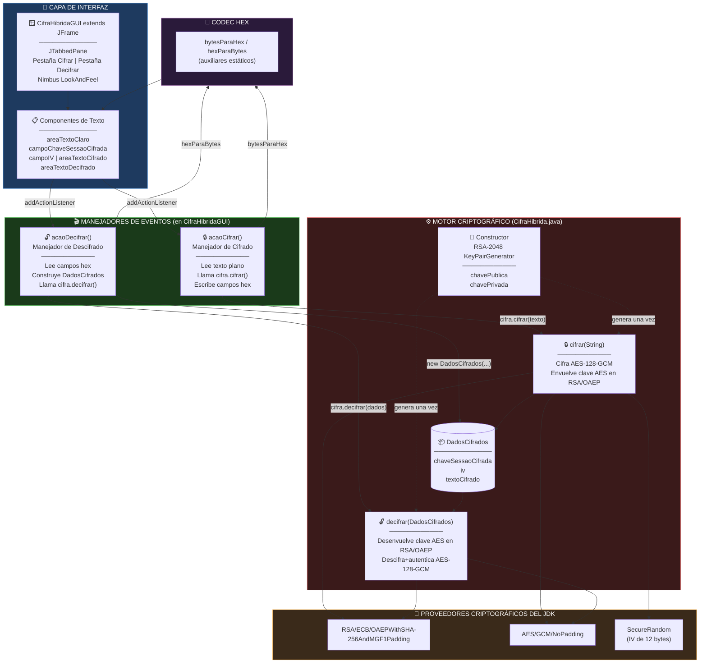
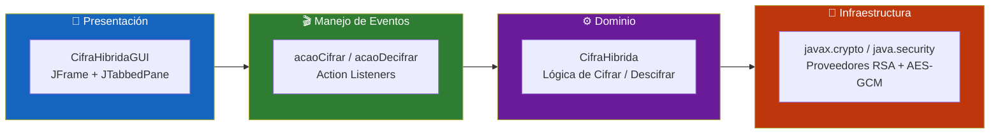
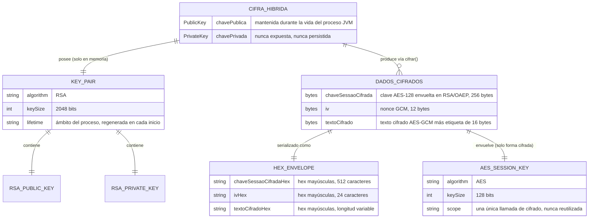
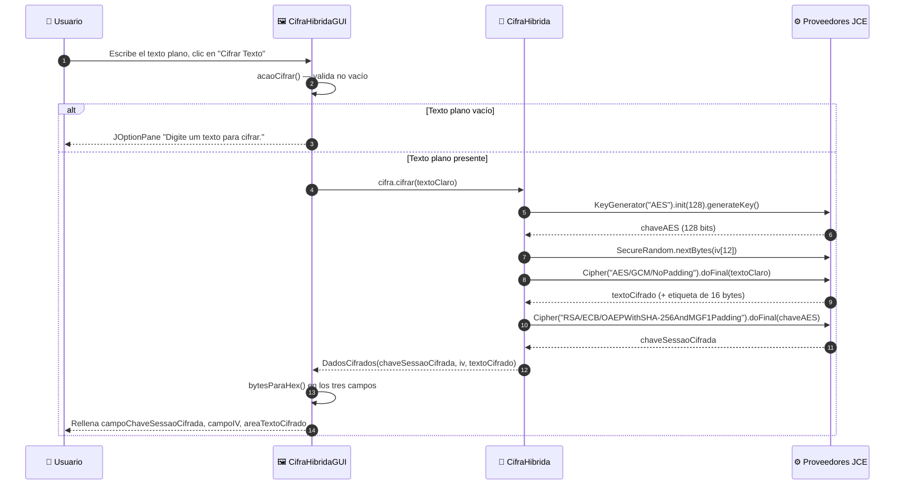
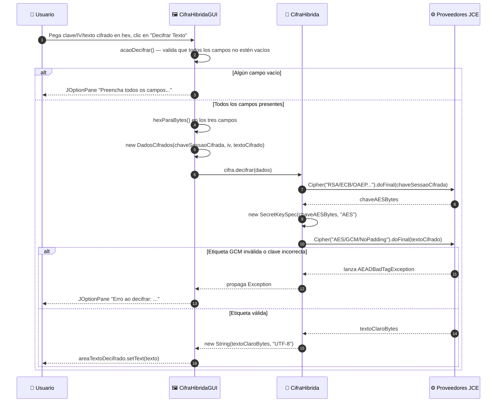
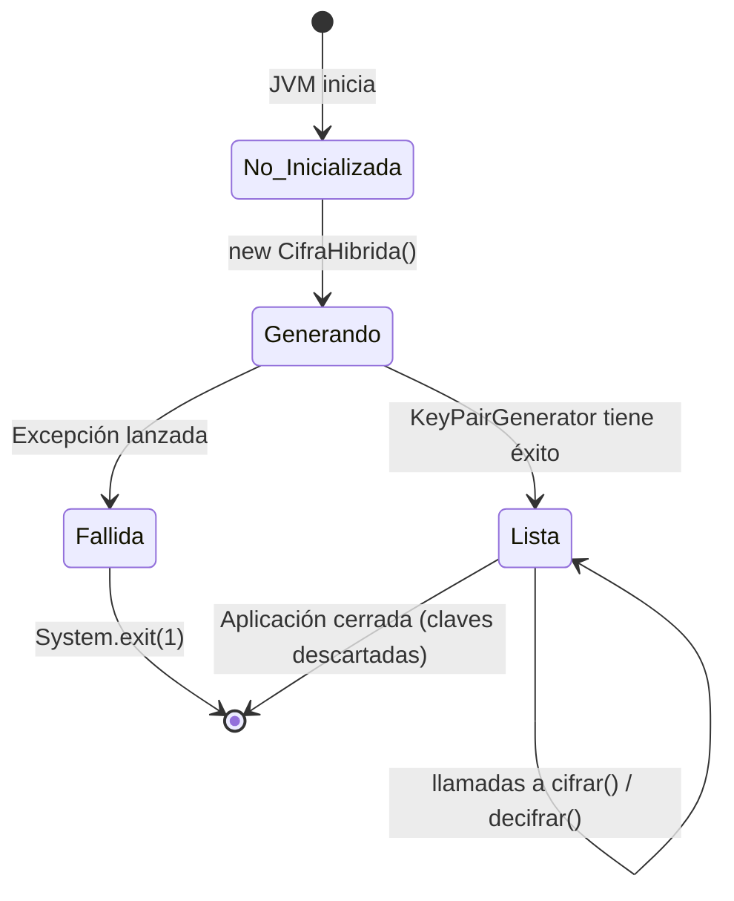
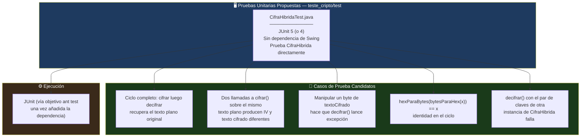

<div align="center">

**🌐 Choose Language / Selecione o Idioma / Elija el Idioma**

[](README.md)&nbsp;&nbsp;&nbsp;[](README_PT.md)&nbsp;&nbsp;&nbsp;[](README_ES.md)

</div>

---

<div align="center">

```
 ██████╗██╗███████╗██████╗  █████╗ 
██╔════╝██║██╔════╝██╔══██╗██╔══██╗
██║     ██║█████╗  ██████╔╝███████║
██║     ██║██╔══╝  ██╔══██╗██╔══██║
╚██████╗██║██║     ██║  ██║██║  ██║
 ╚═════╝╚═╝╚═╝     ╚═╝  ╚═╝╚═╝  ╚═╝
   Aplicación de Escritorio de Cifrado Híbrido RSA-2048 + AES-128-GCM
```

---

[](https://openjdk.org/)
[](https://docs.oracle.com/javase/tutorial/uiswing/)
[](https://netbeans.apache.org/)
[]()
[]()
[]()
[]()

<br/>

> **Una aplicación de escritorio nativa en Java Swing que demuestra cifrado híbrido**
> combinando intercambio de claves asimétrico RSA-2048 con cifrado simétrico autenticado AES-128-GCM.

<br/>


-B71C1C?style=flat-square)

</div>

---

## 📑 Tabla de Contenidos

<details>
<summary>▶️ <strong>Haga clic para expandir / contraer esta sección</strong></summary>

<table>
<tr>
<td valign="top" width="50%">

**🏗️ Sistema**
- [Visión General](#-visión-general)
- [Arquitectura del Sistema](#-arquitectura-del-sistema)
- [Stack Tecnológico](#-stack-tecnológico)
- [Patrones de Diseño Aplicados](#-patrones-de-diseño-aplicados)
- [Estructura del Proyecto](#-estructura-del-proyecto)

**📦 Módulos**
- [CifraHibrida — Motor Criptográfico](#-cifrahibrida--motor-criptográfico-híbrido)
- [DadosCifrados — Contenedor de Datos Cifrados](#-dadoscifrados--contenedor-de-datos-cifrados)
- [CifraHibridaGUI — Interfaz Swing](#-cifrahibridagui--interfaz-swing)
- [Auxiliares de Codificación Hex](#-auxiliares-de-codificación-hex)

</td>
<td valign="top" width="50%">

**💼 Negocio**
- [Reglas de Negocio](#-reglas-de-negocio)
- [Requisitos Funcionales](#-requisitos-funcionales)
- [Requisitos No Funcionales](#-requisitos-no-funcionales)

**📐 Diseño**
- [Modelo de Datos](#-modelo-de-datos)
- [Flujos del Sistema](#-flujos-del-sistema)
- [Flujo de Cifrado](#flujo-de-cifrado)
- [Flujo de Descifrado](#flujo-de-descifrado)
- [Flujo de Eventos de la GUI](#flujo-de-eventos-de-la-gui)

**🔐 Seguridad & Operaciones**
- [Seguridad](#-seguridad)
- [Instalación & Ejecución](#-instalación--ejecución)
- [Pruebas Automatizadas](#-pruebas-automatizadas)
- [Métricas & Monitoreo](#-métricas--monitoreo)
- [Limitaciones Conocidas](#-limitaciones-conocidas)

</td>
</tr>
</table>

---

</details>

## 🌟 Visión General

<details>
<summary>▶️ <strong>Haga clic para expandir / contraer esta sección</strong></summary>

**CifraHibrida** (`teste_cripto`) es una pequeña aplicación de escritorio Java Swing, autocontenida, que demuestra el patrón de **cifrado híbrido** usado por protocolos del mundo real como TLS y PGP: un **cifrado simétrico** rápido (AES-128 en modo GCM) protege el mensaje en sí, mientras que un **cifrado asimétrico** más lento, pero adecuado para el intercambio de claves (RSA-2048), protege la clave simétrica de un solo uso. Cada identificador en el código fuente, desde nombres de clases hasta nombres de variables, está en portugués, reflejando el origen del proyecto como un ejercicio educativo de criptografía.

La aplicación tiene exactamente dos clases. `CifraHibrida.java` es el motor criptográfico: genera un par de claves RSA-2048 en la construcción, expone un método `cifrar()` (cifrar) que produce un texto cifrado con AES más una clave de sesión AES envuelta (wrapped) en RSA, y un método `decifrar()` (descifrar) que revierte el proceso. `CifraHibridaGUI.java` es una interfaz Swing basada en `JFrame` con dos pestañas, "Cifrar" y "Decifrar", que permite al usuario escribir un texto plano, cifrarlo y ver los tres arreglos de bytes resultantes (clave de sesión, IV, texto cifrado) renderizados como texto hexadecimal, o pegar valores hexadecimales de vuelta para descifrarlos.

No existe **base de datos, socket de red ni persistencia en archivo** en ninguna parte del código. El par de claves RSA vive únicamente en la memoria del objeto `CifraHibrida` durante la vida del proceso de la JVM en ejecución; cerrar la aplicación lo descarta de forma irrecuperable. Esta es una decisión de diseño deliberada, aunque no declarada explícitamente en el código, inherente al pequeño alcance didáctico del proyecto, y se documenta honestamente a lo largo de este README, particularmente en [Seguridad](#-seguridad) y [Limitaciones Conocidas](#-limitaciones-conocidas).

### 🎯 Objetivos del Sistema

| Objetivo | Descripción |
|-----------|-------------|
| 🔑 **Generación de Par de Claves** | Generar un nuevo par de claves RSA-2048 cada vez que la aplicación inicia, vía `KeyPairGenerator` |
| 🔒 **Cifrado Simétrico** | Cifrar texto plano UTF-8 arbitrario con una clave AES de 128 bits recién generada en modo GCM |
| 🎁 **Envoltura de Clave** | Cifrar (envolver) la clave AES de un solo uso con la clave pública RSA usando relleno OAEP |
| 🔓 **Ciclo de Descifrado** | Desenvolver la clave AES con la clave privada RSA, luego descifrar y autenticar el texto cifrado |
| 🔡 **Transporte Legible por Humanos** | Codificar cada arreglo de bytes criptográfico (clave, IV, texto cifrado) como texto hexadecimal en mayúsculas |
| 🖼️ **Demostración Interactiva** | Proporcionar una GUI Swing de dos pestañas para que el usuario cifre y descifre sin escribir código |
| 🎨 **Apariencia Nativa** | Usar el `LookAndFeel` Nimbus para una apariencia de escritorio moderna |
| 📦 **Cero Dependencias Externas** | Depender exclusivamente de las APIs `java.security` y `javax.crypto` incluidas en el JDK |

---

</details>

## 🏗️ Arquitectura del Sistema

<details>
<summary>▶️ <strong>Haga clic para expandir / contraer esta sección</strong></summary>

### Diagrama de Módulos



### Capas de Arquitectura



---

</details>

## 🛠️ Stack Tecnológico

<details>
<summary>▶️ <strong>Haga clic para expandir / contraer esta sección</strong></summary>

<table>
<thead>
<tr>
<th>Capa</th>
<th>Tecnología</th>
<th>Versión</th>
<th>Propósito</th>
</tr>
</thead>
<tbody>
<tr>
<td rowspan="2"><strong>🧠 Lenguaje</strong></td>
<td>Java</td>
<td>17 (<code>javac.source</code> / <code>javac.target</code>)</td>
<td>Nivel de código fuente y bytecode de destino de la aplicación</td>
</tr>
<tr>
<td>UTF-8</td>
<td><code>source.encoding</code></td>
<td>Codificación de los archivos fuente y las cadenas de texto plano</td>
</tr>
<tr>
<td rowspan="2"><strong>🖼️ Kit de UI</strong></td>
<td>Java Swing</td>
<td>Incluido en el JDK</td>
<td><code>JFrame</code>, <code>JTabbedPane</code>, <code>JTextArea</code>, <code>JTextField</code>, <code>JButton</code></td>
</tr>
<tr>
<td>Nimbus LookAndFeel</td>
<td>Incluido en el JDK</td>
<td>Tema moderno multiplataforma aplicado vía <code>UIManager</code></td>
</tr>
<tr>
<td rowspan="2"><strong>🔐 Criptografía Asimétrica</strong></td>
<td>RSA</td>
<td>2048 bits</td>
<td><code>KeyPairGenerator</code> / <code>Cipher</code> — envoltura de la clave de sesión</td>
</tr>
<tr>
<td>Relleno OAEP</td>
<td>SHA-256 + MGF1</td>
<td>Transformación <code>RSA/ECB/OAEPWithSHA-256AndMGF1Padding</code></td>
</tr>
<tr>
<td rowspan="2"><strong>🔒 Criptografía Simétrica</strong></td>
<td>AES</td>
<td>128 bits</td>
<td><code>KeyGenerator</code> / <code>Cipher</code> — cifrado del mensaje</td>
</tr>
<tr>
<td>Modo GCM</td>
<td>Etiqueta de autenticación de 128 bits, IV de 12 bytes</td>
<td><code>AES/GCM/NoPadding</code> — confidencialidad + integridad en un solo paso</td>
</tr>
<tr>
<td><strong>🎲 Aleatoriedad</strong></td>
<td>SecureRandom</td>
<td>Incluido en el JDK</td>
<td>Generación criptográficamente segura del IV</td>
</tr>
<tr>
<td><strong>🔡 Codificación</strong></td>
<td>Códec Hex Personalizado</td>
<td>—</td>
<td>Auxiliares estáticos <code>bytesParaHex</code> / <code>hexParaBytes</code>, sin biblioteca externa</td>
</tr>
<tr>
<td rowspan="2"><strong>🔧 Compilación</strong></td>
<td>Apache Ant</td>
<td>Generado por NetBeans (<code>build-impl.xml</code>)</td>
<td>Ciclo de vida de compilar, ejecutar, empaquetar (jar), probar, limpiar</td>
</tr>
<tr>
<td>Modelo de Proyecto NetBeans</td>
<td><code>org.netbeans.modules.java.j2seproject</code></td>
<td>Metadatos del IDE en <code>nbproject/</code></td>
</tr>
</tbody>
</table>

---

</details>

## 🎨 Patrones de Diseño Aplicados

<details>
<summary>▶️ <strong>Haga clic para expandir / contraer esta sección</strong></summary>

| Patrón | Dónde | Justificación |
|---------|-------|-----------|
| 🎁 **Cifrado por Sobre (Sistema Híbrido)** | `CifraHibrida.cifrar()` / `decifrar()` | El mensaje grueso se cifra con AES rápido; solo la pequeña clave AES se cifra con RSA lento |
| 📦 **Objeto de Valor / DTO** | `CifraHibrida.DadosCifrados` (clase interna estática) | Portador inmutable por convención para los tres componentes del texto cifrado, solo con getters |
| 🧩 **Clase Interna Estática** | `DadosCifrados` declarada dentro de `CifraHibrida` | Agrupa la forma del texto cifrado con el motor que lo produce y consume |
| 🧭 **Fachada (Facade)** | `cifrar(String)` / `decifrar(DadosCifrados)` | Dos métodos de una sola llamada ocultan la generación de claves, generación de IV, configuración de parámetros GCM y envoltura RSA |
| 🎬 **Observer / Callback (Listener Lambda)** | `botaoCifrar.addActionListener(e -> acaoCifrar())` | Reacción orientada a eventos de Swing ante clics de botón |
| 🔡 **Códec / Traductor** | `bytesParaHex` / `hexParaBytes` | Convierte entre el dominio binario de `javax.crypto` y el dominio textual de `JTextArea` |
| 🚦 **Cláusula de Guarda** | `if (textoClaro == null \|\| textoClaro.isEmpty())` en `acaoCifrar()` | El retorno anticipado mantiene el camino feliz del manejador simple |
| 🏗️ **Fábrica Estática vía Constructor** | `new CifraHibrida()` lanza `Exception` verificada | La generación del par de claves es inseparable de la construcción del objeto, obligando a los llamadores a manejar el fallo de inmediato |

---

</details>

## 📁 Estructura del Proyecto

<details>
<summary>▶️ <strong>Haga clic para expandir / contraer esta sección</strong></summary>

```
programa_criptografico_chaves/
│
├── 📄 README.md                          # 🇺🇸 English (primary)
├── 📄 README_PT.md                       # 🇧🇷 Português
├── 📄 README_ES.md                       # 🇪🇸 Español (este archivo)
├── 📄 .gitignore                         # Reglas de exclusión (artefactos build/dist de NetBeans)
│
└── 📂 teste_cripto/                      # Proyecto NetBeans Ant Java SE (nombre real del proyecto)
    │
    ├── 📄 build.xml                      # Punto de entrada de Ant, importa nbproject/build-impl.xml
    ├── 📄 manifest.mf                    # Stub del manifest del JAR (Main-Class inyectado por el build)
    │
    ├── 📂 src/
    │   ├── 📄 CifraHibrida.java          # ★ Motor criptográfico — generación de claves, cifrar(), decifrar() (113 líneas)
    │   └── 📄 CifraHibridaGUI.java       # ★ GUI Swing — JFrame, pestañas, manejadores de eventos (249 líneas)
    │
    ├── 📂 nbproject/
    │   ├── 📄 project.xml                # Tipo de proyecto NetBeans + declaración de raíces src/test
    │   ├── 📄 project.properties         # javac.source=17, main.class, dist.jar, run.classpath, ...
    │   ├── 📄 build-impl.xml             # Implementación Ant generada (compile/run/jar/test/clean)
    │   ├── 📄 genfiles.properties         # Control interno de generación de NetBeans
    │   └── 📂 private/                   # Configuración local de NetBeans, específica de la máquina (no portable)
    │
    ├── 📂 build/                         # 📤 Salida de clases compiladas (creada por `ant compile`, descartable)
    │
    └── 📂 dist/                          # 📤 Salida de distribución (creada por `ant jar`)
        ├── 📄 README.TXT                 # Texto estándar generado por NetBeans sobre la carpeta dist
        └── 📄 teste_cripto.jar           # JAR ejecutable (Main-Class: CifraHibridaGUI)
```

> [!NOTE]
> `build/` y `dist/` son artefactos generados, no código fuente. Se recrean con `ant compile` / `ant jar` y pueden eliminarse de forma segura con `ant clean`. No existe la carpeta `test/`, a pesar de que `nbproject/project.properties` declara `test.src.dir=test` — el directorio nunca fue creado, por lo que aún no existen pruebas automatizadas. Ver [Pruebas Automatizadas](#-pruebas-automatizadas).

---

</details>

## 📦 Módulos del Sistema

<details>
<summary>▶️ <strong>Haga clic para expandir / contraer esta sección</strong></summary>

### 🔐 CifraHibrida — Motor Criptográfico Híbrido

`CifraHibrida.java` es todo el núcleo criptográfico de la aplicación: 113 líneas, una clase pública, una clase interna estática, seis métodos en total (constructor, `cifrar`, `decifrar`, `getChaveSessaoCifrada`/`getIv`/`getTextoCifrado` en el tipo interno, más los dos auxiliares hex estáticos).

| Responsabilidad | Implementación |
|-----------------|-----------------|
| Generación del par de claves | Constructor: `KeyPairGenerator.getInstance("RSA")`, `initialize(2048)`, `generateKeyPair()` |
| Estado mantenido | `private PublicKey chavePublica;` `private PrivateKey chavePrivada;` — nunca expuesto vía getters |
| Punto de entrada de cifrado | `public DadosCifrados cifrar(String textoClaro) throws Exception` |
| Punto de entrada de descifrado | `public String decifrar(DadosCifrados dados) throws Exception` |
| Modo de fallo | Toda excepción criptográfica verificada (`NoSuchAlgorithmException`, `InvalidKeyException`, `BadPaddingException`, ...) se propaga como `Exception` al llamador |

---

### 📦 DadosCifrados — Contenedor de Datos Cifrados

Una `public static class` interna a `CifraHibrida`. Es un portador simple de tres campos, inmutable por convención (los campos son `private` y se definen solo en el constructor; no existen setters).

| Campo | Tipo | Significado |
|-------|------|---------|
| `chaveSessaoCifrada` | `byte[]` | La clave de sesión AES de 128 bits, tras el cifrado RSA/OAEP con la clave pública |
| `iv` | `byte[]` | El vector de inicialización GCM de 12 bytes (nonce), generado en cada cifrado |
| `textoCifrado` | `byte[]` | El texto cifrado AES-GCM, con la etiqueta de autenticación de 128 bits anexada por el proveedor JCE |

Se accede mediante `getChaveSessaoCifrada()`, `getIv()`, `getTextoCifrado()`. `CifraHibridaGUI` también construye un `DadosCifrados` directamente vía su constructor público al reconstituir la entrada hex de vuelta en bytes para el descifrado.

---

### 🖼️ CifraHibridaGUI — Interfaz Swing

`CifraHibridaGUI.java` (249 líneas) extiende `JFrame` y es dueña de toda la capa de presentación, además de los dos manejadores de eventos que conectan la UI con `CifraHibrida`.

| Responsabilidad | Implementación |
|-----------------|-----------------|
| Configuración de la ventana | El constructor llama a `super("Cifra Híbrida - Interface Moderna")`, instancia `CifraHibrida`, llama a `inicializarComponentes()` |
| Look and feel | Itera `UIManager.getInstalledLookAndFeels()`, aplica `"Nimbus"` si se encuentra, tanto en el constructor como en `main()` |
| Diseño | `JTabbedPane` con dos pestañas: `"Cifrar"` (`painelCifrar`) y `"Decifrar"` (`painelDecifrar`), cada una un `BorderLayout` de subpaneles con título |
| Campos de la pestaña Cifrar | `areaTextoClaro` (entrada), `campoChaveSessaoCifrada`, `campoIV`, `areaTextoCifrado` (salidas de solo lectura) |
| Campos de la pestaña Decifrar | `areaChaveSessaoCifrada`, `areaIV`, `areaTextoCifradoDecifrar` (entradas), `areaTextoDecifrado` (salida de solo lectura) |
| Punto de entrada | `public static void main(String[] args)` — aplica Nimbus, luego `SwingUtilities.invokeLater(() -> new CifraHibridaGUI().setVisible(true))` |

---

### 🎬 Manejadores de Eventos

| Manejador | Disparo | Comportamiento |
|---------|---------|-----------|
| `acaoCifrar()` | Clic en `botaoCifrar` ("Cifrar Texto") | Valida texto plano no vacío, llama a `cifra.cifrar(textoClaro)`, escribe los tres resultados como hex en los campos de la pestaña de cifrado |
| `acaoDecifrar()` | Clic en `botaoDecifrar` ("Decifrar Texto") | Valida que los tres campos hex no estén vacíos, los convierte a bytes, construye un `DadosCifrados`, llama a `cifra.decifrar(dados)`, escribe el resultado en texto plano |

Ambos manejadores capturan `Exception` de forma amplia y muestran el mensaje vía `JOptionPane.showMessageDialog`, de modo que una cadena hex malformada o una etiqueta GCM manipulada nunca derriba el hilo de la UI — produce un diálogo en su lugar.

---

### 🔡 Auxiliares de Codificación Hex

Dos métodos utilitarios `public static` en `CifraHibrida`, usados tanto por la propia clase (indirectamente, a través de la GUI) como directamente por `CifraHibridaGUI`.

| Método | Firma | Comportamiento |
|--------|-----------|-----------|
| `bytesParaHex` | `static String bytesParaHex(byte[] bytes)` | Añade `String.format("%02X", b)` por cada byte — mayúsculas, sin separadores |
| `hexParaBytes` | `static byte[] hexParaBytes(String hex)` | Analiza dos caracteres hex por byte de salida vía `Character.digit(c, 16)`; asume entrada bien formada y de longitud par |

> [!NOTE]
> `hexParaBytes` no realiza validación de longitud ni de conjunto de caracteres. Una cadena de longitud impar o no hexadecimal lanza una excepción no verificada (`StringIndexOutOfBoundsException` o un valor de byte malformado), capturada únicamente por el `catch (Exception ex)` amplio en `acaoDecifrar()`.

---

</details>

## 💼 Reglas de Negocio

<details>
<summary>▶️ <strong>Haga clic para expandir / contraer esta sección</strong></summary>

### 🔑 Reglas del Ciclo de Vida de la Clave

| # | Regla | Cumplimiento |
|---|------|-------------|
| RN-01 | Existe exactamente un par de claves RSA-2048 por instancia de `CifraHibrida` en ejecución | Generado una única vez, en el constructor, nunca regenerado |
| RN-02 | La clave privada nunca se serializa, muestra o escribe en disco | No existe getter para `chavePrivada`; ninguna E/S de archivo en la clase |
| RN-03 | Se genera un nuevo par de claves en cada inicio de la aplicación | `new CifraHibrida()` se llama una vez en el constructor de `CifraHibridaGUI`, que a su vez se ejecuta una vez por proceso |

### 🔒 Reglas de Cifrado

| # | Regla | Cumplimiento |
|---|------|-------------|
| RN-04 | Todo cifrado usa una clave AES-128 nueva y de un solo uso | `KeyGenerator.getInstance("AES").init(128)` dentro de `cifrar()`, llamado en cada invocación |
| RN-05 | Todo cifrado usa un IV nuevo y aleatorio de 12 bytes | `SecureRandom.nextBytes(iv)` dentro de `cifrar()` |
| RN-06 | La clave AES nunca se transmite ni se muestra en claro | Solo `chaveSessaoCifrada` (la forma envuelta en RSA) sale de `cifrar()` |
| RN-07 | El texto plano debe ser codificable en UTF-8 | `textoClaro.getBytes("UTF-8")` — lanza excepción en fallo de codificación (prácticamente nunca ocurre para `String`) |

### 🔓 Reglas de Descifrado

| # | Regla | Cumplimiento |
|---|------|-------------|
| RN-08 | El descifrado requiere los tres componentes: clave envuelta, IV, texto cifrado | `decifrar(DadosCifrados)` recibe un único argumento compuesto; la GUI bloquea el envío si algún campo hex está vacío |
| RN-09 | La etiqueta de autenticación GCM debe ser válida, o el descifrado falla | `Cipher.doFinal` lanza `AEADBadTagException` (subtipo de `Exception`) ante texto cifrado manipulado o clave incorrecta |
| RN-10 | El descifrado solo es posible con la clave privada que corresponde a la clave pública usada para envolver la clave de sesión | RSA es asimétrico; un par de claves incompatible falla en `cifraRSA.doFinal` |

---

</details>

## ✅ Requisitos Funcionales

<details>
<summary>▶️ <strong>Haga clic para expandir / contraer esta sección</strong></summary>

| ID | Requisito | Prioridad | Estado |
|----|-------------|----------|--------|
| **RF-01** | El sistema debe generar un par de claves RSA-2048 en el inicio | 🔴 Alta | ✅ Implementado |
| **RF-02** | El sistema debe presentar una GUI con una pestaña "Cifrar" y una pestaña "Decifrar" | 🔴 Alta | ✅ Implementado |
| **RF-03** | El sistema debe aceptar texto plano arbitrario en un área de texto multilínea | 🔴 Alta | ✅ Implementado |
| **RF-04** | El sistema debe rechazar un intento de cifrado con texto plano vacío, mostrando un diálogo | 🟡 Media | ✅ Implementado |
| **RF-05** | El sistema debe generar una clave AES-128 nueva en cada cifrado | 🔴 Alta | ✅ Implementado |
| **RF-06** | El sistema debe generar un IV de 12 bytes nuevo en cada cifrado | 🔴 Alta | ✅ Implementado |
| **RF-07** | El sistema debe cifrar el texto plano con AES/GCM/NoPadding | 🔴 Alta | ✅ Implementado |
| **RF-08** | El sistema debe envolver la clave AES con RSA/ECB/OAEPWithSHA-256AndMGF1Padding | 🔴 Alta | ✅ Implementado |
| **RF-09** | El sistema debe mostrar la clave envuelta, el IV y el texto cifrado como hexadecimal en mayúsculas | 🔴 Alta | ✅ Implementado |
| **RF-10** | El sistema debe aceptar clave envuelta, IV y texto cifrado en hexadecimal para el descifrado | 🔴 Alta | ✅ Implementado |
| **RF-11** | El sistema debe rechazar un intento de descifrado con cualquier campo vacío | 🟡 Media | ✅ Implementado |
| **RF-12** | El sistema debe desenvolver la clave AES con la clave privada RSA | 🔴 Alta | ✅ Implementado |
| **RF-13** | El sistema debe descifrar y autenticar el texto cifrado con AES/GCM | 🔴 Alta | ✅ Implementado |
| **RF-14** | El sistema debe mostrar el texto plano recuperado en un área de texto de solo lectura | 🔴 Alta | ✅ Implementado |
| **RF-15** | El sistema debe mostrar un diálogo de error ante cualquier fallo de cifrado | 🟡 Media | ✅ Implementado |
| **RF-16** | El sistema debe mostrar un diálogo de error ante cualquier fallo de descifrado (incluyendo divergencia de etiqueta) | 🟡 Media | ✅ Implementado |
| **RF-17** | El sistema debe aplicar el Look and Feel Nimbus cuando esté disponible | 🟢 Baja | ✅ Implementado |
| **RF-18** | El sistema debe finalizar el proceso si la generación del par de claves falla en el inicio | 🟡 Media | ✅ Implementado |
| **RF-19** | El sistema debe ejecutarse como un JAR ejecutable autónomo con `Main-Class: CifraHibridaGUI` | 🔴 Alta | ✅ Implementado |
| **RF-20** | El sistema debe persistir la clave de cifrado entre reinicios de la aplicación | 🟢 Baja | ⬜ Planificado |
| **RF-21** | El sistema debe validar la entrada hexadecimal antes de intentar decodificarla | 🟡 Media | ⬜ Planificado |
| **RF-22** | El sistema debe soportar guardar la salida cifrada en un archivo | 🟢 Baja | ⬜ Planificado |

---

</details>

## ⚡ Requisitos No Funcionales

<details>
<summary>▶️ <strong>Haga clic para expandir / contraer esta sección</strong></summary>

| ID | Categoría | Requisito | Objetivo |
|----|----------|-------------|--------|
| **RNF-01** | ⚡ Rendimiento | Generación del par de claves RSA-2048 en el inicio | < 500 ms en hardware común |
| **RNF-02** | ⚡ Rendimiento | Ciclo completo de cifrado/descifrado para texto corto | < 50 ms |
| **RNF-03** | 🔐 Seguridad | Modo del cifrado simétrico | Autenticado (AES-GCM), nunca ECB/CBC no autenticado para datos de mensaje |
| **RNF-04** | 🔐 Seguridad | Esquema de relleno asimétrico | OAEP (nunca raw/PKCS#1 v1.5) para la envoltura de la clave RSA |
| **RNF-05** | 🔐 Seguridad | Fuente de aleatoriedad para claves e IVs | `SecureRandom` / predeterminado de JCE (CSPRNG), nunca `java.util.Random` |
| **RNF-06** | 📦 Tamaño | Tamaño del JAR ejecutable | < 20 KB (sin dependencias empaquetadas) |
| **RNF-07** | 🧠 Memoria | Heap residente para una única instancia de `CifraHibrida` | < 10 MB |
| **RNF-08** | 🎨 Usabilidad | Cada acción produce retroalimentación visible (diálogo o actualización de campo) | 100% de los clics de botón |
| **RNF-09** | 🖥️ Portabilidad | Se ejecuta sin modificaciones en cualquier host JDK 17+ con pantalla (Windows, Linux, macOS) | Sin código nativo, sin APIs específicas de plataforma |
| **RNF-10** | 🔧 Mantenibilidad | Cero dependencias de terceros | Solo `javax.crypto`, `java.security`, `javax.swing` |
| **RNF-11** | 🧱 Reproducibilidad del build | Build Ant determinista vía archivos de proyecto NetBeans | `ant clean jar` produce siempre el mismo diseño de clases |
| **RNF-12** | 🌍 Internacionalización | Etiquetas de la UI | Actualmente literales en portugués, no externalizadas |
| **RNF-13** | ♿ Accesibilidad | Áreas de texto y campos legibles por lectores de pantalla | Componentes Swing estándar (soporte básico JAAS/AT-SPI), sin renderizado personalizado |
| **RNF-14** | 🧪 Capacidad de prueba | Lógica criptográfica separable de la UI para pruebas unitarias | `CifraHibrida` no tiene dependencia de Swing, por lo que es probable de forma independiente |

---

</details>

## 🗄️ Modelo de Datos

<details>
<summary>▶️ <strong>Haga clic para expandir / contraer esta sección</strong></summary>

> [!NOTE]
> Esta aplicación **no tiene base de datos ni persistencia en archivo**. No hay nada que modelar en el sentido relacional o documental tradicional. A continuación se presenta la forma del objeto en memoria mantenida durante una sesión, y el formato de transporte hexadecimal, que es lo único que efectivamente cruza un límite de confianza (los campos de texto de la GUI y, por extensión, el portapapeles o las notas del usuario, si copia los valores hacia afuera).

### Diagrama Entidad-Relación



### Forma del Objeto en Memoria

| Campo | Propietario | Tipo | ¿Persistido? | Notas |
|-------|-------|------|-----------|-------|
| `chavePublica` | `CifraHibrida` | `java.security.PublicKey` | No | Vive solo en memoria heap |
| `chavePrivada` | `CifraHibrida` | `java.security.PrivateKey` | No | Nunca sale del objeto, sin getter |
| `chaveSessaoCifrada` | `DadosCifrados` | `byte[]` (256 bytes para RSA-2048/OAEP-SHA256) | No | Envuelta en RSA, segura para mostrar como hex |
| `iv` | `DadosCifrados` | `byte[]` (12 bytes) | No | Nonce GCM, no es secreto pero nunca debe repetirse bajo la misma clave |
| `textoCifrado` | `DadosCifrados` | `byte[]` (longitud del texto plano + etiqueta de 16 bytes) | No | Texto cifrado con etiqueta de autenticación anexada por el proveedor JCE |

### Formato de Transporte Hexadecimal

| Campo | Bytes de Origen | Caracteres Hex | Forma de Ejemplo |
|-------|--------------|-----------------|-----------------|
| Chave de Sessão Cifrada | 256 bytes (bloque de salida RSA-2048) | 512 caracteres hex | `A1B2C3...` (512 caracteres) |
| IV (Nonce) | 12 bytes | 24 caracteres hex | `9F00A1B2C3D4E5F607182930` |
| Texto Cifrado | longitud del texto plano + 16 | 2×(N+16) caracteres hex | variable, crece con el tamaño del mensaje |

No existe prefijo de longitud, delimitador ni formato de sobre que una estas tres cadenas hex, más allá de los tres campos Swing separados; el usuario debe copiar las tres correctamente y en orden para que `acaoDecifrar()` tenga éxito.

---

</details>

## 🔄 Flujos del Sistema

<details>
<summary>▶️ <strong>Haga clic para expandir / contraer esta sección</strong></summary>

### Flujo de Cifrado



### Flujo de Descifrado



### Flujo de Eventos de la GUI

```mermaid
flowchart TD
    START([Inicio de la aplicación]) --> MAIN[main: aplica Nimbus,\ninvokeLater]
    MAIN --> CTOR[Constructor de CifraHibridaGUI]
    CTOR --> KEYPAIR{CifraHibrida()\ngeneración del par de claves}
    KEYPAIR -- Excepción --> FATAL[showMessageDialog +\nSystem.exit 1]
    KEYPAIR -- OK --> INIT[inicializarComponentes\nconstruye pestañas y campos]
    INIT --> READY([Ventana visible, inactiva])
    READY -- clic Cifrar --> ENC[acaoCifrar]
    READY -- clic Decifrar --> DEC[acaoDecifrar]
    ENC --> READY
    DEC --> READY

    style START fill:#1565C0,color:#fff
    style READY fill:#2E7D32,color:#fff
    style FATAL fill:#B71C1C,color:#fff
```

### Máquina de Estados del Par de Claves



---

</details>

## 🔐 Seguridad

<details>
<summary>▶️ <strong>Haga clic para expandir / contraer esta sección</strong></summary>

### Controles Implementados

| Control | Implementación | Efecto |
|---------|---------------|--------|
| 🔑 **Tamaño de clave asimétrica fuerte** | RSA `initialize(2048)` | Cumple con el mínimo actualmente recomendado (2026) para robustez RSA |
| 🎁 **Relleno OAEP, no PKCS#1 v1.5** | `RSA/ECB/OAEPWithSHA-256AndMGF1Padding` | Resistente a ataques de oráculo de relleno estilo Bleichenbacher, que afectan al PKCS#1 v1.5 crudo |
| 🔒 **Cifrado simétrico autenticado** | `AES/GCM/NoPadding`, etiqueta de 128 bits | Confidencialidad e integridad/autenticidad en una sola primitiva; la manipulación se detecta, no se descifra silenciosamente |
| 🎲 **IV nuevo en cada cifrado** | `SecureRandom` genera un nuevo IV de 12 bytes dentro de cada llamada a `cifrar()` | Evita el modo de fallo catastrófico de reutilización de nonce de AES-GCM |
| 🎯 **Clave de sesión nueva en cada cifrado** | Nueva `SecretKey` AES generada dentro de cada llamada a `cifrar()` | Limita el radio de impacto de cualquier compromiso de clave a un solo mensaje |
| 🚫 **Clave privada nunca expuesta** | No existe getter para `chavePrivada`; nunca se registra, imprime o serializa | No puede filtrarse a través de la API pública del objeto |
| 🌐 **Sin exposición de red** | Ningún socket, ningún cliente HTTP, ningún puerto en escucha en ninguna parte del código | El texto cifrado, las claves y el texto plano nunca salen del proceso local |
| ✅ **Excepciones expuestas, no ignoradas** | Ambos manejadores capturan y muestran `Exception`, nunca ignoran silenciosamente un fallo criptográfico | Un texto cifrado manipulado o corrupto produce un error visible, no un descifrado "exitoso" incorrecto |

### Limitaciones de Seguridad Conocidas

> [!WARNING]
> Este es un proyecto didáctico/de demostración. Las siguientes limitaciones son inherentes a su alcance actual y deben entenderse, y la mayoría deben resolverse, antes de cualquier adaptación a un contexto de producción o de datos sensibles.

| Limitación | Riesgo | Camino de Mitigación |
|------------|------|-----------------|
| 🗝️ **El par de claves RSA nunca se persiste** | El texto cifrado en una sesión queda **permanentemente indescifrable** una vez que la aplicación se cierra, a menos que el usuario haya guardado manualmente la clave envuelta en hex junto con una clave privada exportada por separado (lo cual la GUI no ofrece forma de hacer) | Añadir exportación/importación explícita de claves (p. ej., archivos PEM PKCS#8/X.509, opcionalmente cifrados con contraseña) |
| 🔄 **Se genera un nuevo par de claves en cada inicio** | Los datos cifrados en la sesión A nunca pueden descifrarse en la sesión B, incluso por el mismo usuario en la misma máquina, porque `chavePrivada` se regenera desde cero | Cargar un par de claves persistido en el inicio, en lugar de siempre llamar a `generateKeyPair()` |
| 🕵️ **Sin autenticación de la clave pública RSA** | La GUI nunca muestra una huella digital (fingerprint) de `chavePublica`; el usuario no tiene forma de verificar contra qué par de claves fue cifrado un texto determinado, si hay múltiples sesiones o máquinas involucradas | Mostrar una huella digital SHA-256 de la clave pública en la UI, para verificación fuera de banda |
| 🧪 **Sin validación de la entrada hex antes de decodificar** | `hexParaBytes` ante entrada malformada (longitud impar, caracteres no hexadecimales) lanza una excepción no verificada, capturada solo por el `catch (Exception ex)` amplio en `acaoDecifrar()` | Validar con una expresión regular (`^[0-9A-Fa-f]+$` y longitud par) antes de llamar a `hexParaBytes`, con un mensaje específico para el usuario |
| 📋 **Texto plano y cifrado pasan por `JTextArea` / portapapeles de Swing** | Si el usuario copia la salida hex para compartirla, la clave AES envuelta y el texto cifrado pueden quedar retenidos en el historial del portapapeles del SO o pegarse accidentalmente en otro lugar | Documentar esto en una advertencia de la UI; evitar este patrón para cualquier secreto real |
| 🧵 **Sin borrado de memoria del material de clave** | Los `byte[]` que respaldan la clave AES y los componentes de la clave privada RSA quedan a merced del recolector de basura, no se borran explícitamente | Usar `Arrays.fill(sensitiveArray, (byte) 0)` después del uso, donde la superficie de la API lo permita |
| ⚖️ **La denominación "RSA/ECB/..." es una convención de Java/JCE, no un ECB literal de cifrado de bloque** | La palabra "ECB" en la cadena de transformación puede llevar a un lector a pensar que RSA se usa en modo de bloque ECB; en la JCE, "ECB" aquí es un marcador de posición obligatorio pero sin significado para el campo de modo de RSA, y OAEP es el relleno real y seguro vigente | No se necesita corrección técnica; documentar la denominación claramente (como se hace aquí) para no confundirla con AES-ECB, que sí es genuinamente inseguro |
| 🧾 **Sin registro ni rastro de auditoría** | Ningún registro de cuándo ocurrió el cifrado/descifrado, por quién, o cuántos intentos fallaron | Fuera del alcance para una demo de escritorio de un solo usuario; importaría en una implementación multiusuario |

---

</details>

## 🚀 Instalación & Ejecución

<details>
<summary>▶️ <strong>Haga clic para expandir / contraer esta sección</strong></summary>

### Prerrequisitos

```bash
# Java Development Kit 17 o más reciente (javac.source/target = 17)
java -version         # se espera 17+
javac -version        # se espera 17+

# Apache Ant (incluido con NetBeans, o instalar por separado)
ant -version           # se espera Ant 1.9+

# Opcional: Apache NetBeans IDE para una experiencia gráfica de build/ejecución/depuración
```

### Compilación

```bash
# Navegue al proyecto NetBeans real (no la raíz del repositorio)
cd teste_cripto

# Compila todas las fuentes en build/classes
ant compile

# Construye el proyecto completo (compila + copia recursos)
ant

# Empaqueta el JAR ejecutable en dist/teste_cripto.jar
ant jar

# Elimina todos los artefactos de build y dist generados
ant clean
```

### Ejecución

```bash
# Opción A — ejecutar vía Ant (compila si es necesario, luego lanza la GUI)
cd teste_cripto
ant run

# Opción B — ejecutar el JAR empaquetado directamente
java -jar dist/teste_cripto.jar

# Opción C — ejecutar la clase compilada directamente (después de `ant compile`)
java -cp build/classes CifraHibridaGUI
```

**Uso en la aplicación**

1. Inicie **CifraHibrida** — la pestaña "Cifrar" se muestra primero, y un par de claves RSA-2048 se genera silenciosamente en segundo plano.
2. Escriba cualquier texto en la caja "Texto Claro" y haga clic en **Cifrar Texto**.
3. Los campos "Chave de Sessão Cifrada", "IV (Nonce)" y "Texto Cifrado" se rellenan con valores hexadecimales.
4. Vaya a la pestaña "Decifrar" y pegue esos mismos tres valores hex en los campos correspondientes.
5. Haga clic en **Decifrar Texto** — el texto plano original reaparece en "Texto Decifrado".
6. Cerrar la ventana finaliza el proceso y descarta el par de claves RSA; los valores solo se descifran dentro de la misma sesión en ejecución.

### Objetivos de Ant

| Objetivo | Propósito |
|--------|---------|
| `ant compile` | Compila `src/*.java` en `build/classes` |
| `ant` (predeterminado) | Construye el proyecto (equivalente a `ant compile`) |
| `ant jar` | Produce `dist/teste_cripto.jar` con `Main-Class: CifraHibridaGUI` |
| `ant run` | Compila (si es necesario) y lanza `CifraHibridaGUI` |
| `ant test` | Ejecuta el conjunto de fuentes `test/` (actualmente ausente) — ver [Pruebas Automatizadas](#-pruebas-automatizadas) |
| `ant clean` | Elimina los directorios `build/` y `dist/` |
| `ant javadoc` | Genera documentación de la API en `dist/javadoc/` |
| `ant debug` | Lanza bajo una conexión de depurador (`nbproject/build-impl.xml`) |

### Configuración del Build

| Configuración | Valor | Declarado en |
|---------|-------|-------------|
| Nombre del proyecto | `teste_cripto` | `build.xml`, `nbproject/project.xml` |
| `main.class` | `CifraHibridaGUI` | `nbproject/project.properties` |
| `javac.source` / `javac.target` | `17` / `17` | `nbproject/project.properties` |
| `source.encoding` | `UTF-8` | `nbproject/project.properties` |
| `src.dir` | `src` | `nbproject/project.properties` |
| `test.src.dir` | `test` (declarado, carpeta ausente) | `nbproject/project.properties` |
| `dist.jar` | `dist/teste_cripto.jar` | `nbproject/project.properties` |
| `manifest.file` | `manifest.mf` | `nbproject/project.properties` |
| `javac.classpath` | *(vacío)* — cero dependencias externas | `nbproject/project.properties` |

---

</details>

## 🧪 Pruebas Automatizadas

<details>
<summary>▶️ <strong>Haga clic para expandir / contraer esta sección</strong></summary>

> [!IMPORTANT]
> **Actualmente no existen pruebas automatizadas en este proyecto.** `nbproject/project.properties` declara `test.src.dir=test` y el `build-impl.xml` generado por Ant expone un objetivo `ant test`, pero el directorio `teste_cripto/test/` nunca fue creado. Ejecutar `ant test` hoy no ejecuta ninguna prueba, porque no hay nada que compilar o ejecutar. Esto se declara con claridad, conforme al estándar de documentación del proyecto, junto con una suite propuesta a continuación.

### Arquitectura de Pruebas (Propuesta)



| Conjunto de fuentes | Ubicación | Estado |
|------------|----------|--------|
| Pruebas unitarias | `teste_cripto/test/CifraHibridaTest.java` | ⬜ Ausente — propuesto |
| Objetivo Ant | `ant test` (generado por `build-impl.xml`) | ⚠️ Conectado, pero sin nada que ejecutar |

### Ejecutando las Pruebas

```bash
# Una vez que se agreguen un directorio test/ y una dependencia de JUnit a
# nbproject/project.properties (javac.test.classpath):
cd teste_cripto
ant test

# Ubicación del reporte HTML (una vez poblado):
# build/test/results/
```

### Lista de Verificación de Aceptación Manual

| # | Escenario | Resultado esperado |
|---|----------|-----------------|
| 1 | Iniciar la aplicación | La ventana abre en la pestaña "Cifrar", no aparece ningún diálogo |
| 2 | Clic en "Cifrar Texto" con la caja de texto plano vacía | Diálogo: "Digite um texto para cifrar." |
| 3 | Escribir "Hello World" y clic en "Cifrar Texto" | Los tres campos hex se rellenan, no vacíos |
| 4 | Cifrar el mismo texto plano dos veces | Los dos valores hex resultantes de IV y texto cifrado difieren |
| 5 | Ir a "Decifrar", pegar los tres valores hex, clic en "Decifrar Texto" | "Texto Decifrado" muestra "Hello World" exactamente |
| 6 | Clic en "Decifrar Texto" con algún campo vacío | Diálogo: "Preencha todos os campos com os dados cifrados." |
| 7 | Alterar un carácter hex del texto cifrado antes de descifrar | Diálogo: "Erro ao decifrar: ..." (divergencia de etiqueta GCM) |
| 8 | Pegar una cadena de longitud impar o no hexadecimal en cualquier campo de descifrado | Diálogo: "Erro ao decifrar: ..." (fallo de análisis hex) |
| 9 | Cerrar y reiniciar la aplicación, luego pegar valores previos al reinicio | El descifrado falla — el par de claves RSA fue regenerado |
| 10 | Cifrar un párrafo muy largo (varios KB) | El hex del texto cifrado se renderiza y ajusta correctamente en el área de texto desplazable |

---

</details>

## 📊 Métricas & Monitoreo

<details>
<summary>▶️ <strong>Haga clic para expandir / contraer esta sección</strong></summary>

### Métricas del Código

| Métrica | Valor |
|--------|-------|
| Archivos fuente Java | 2 (`CifraHibrida.java`, `CifraHibridaGUI.java`) |
| Líneas de Java (`CifraHibrida.java`) | 113 |
| Líneas de Java (`CifraHibridaGUI.java`) | 249 |
| Clases públicas | 2 (más 1 clase interna estática, `DadosCifrados`) |
| Dependencias externas en tiempo de ejecución | 0 (`javac.classpath` está vacío) |
| Tamaño de la clave RSA | 2048 bits |
| Tamaño de la clave AES | 128 bits |
| Tamaño del IV GCM | 12 bytes (96 bits) |
| Tamaño de la etiqueta de autenticación GCM | 128 bits |
| Archivos de prueba automatizada | 0 |

### Señales en Tiempo de Ejecución

| Señal | Origen | Dónde observar |
|--------|--------|------------------|
| Fallo en la generación del par de claves | `catch (Exception e)` en el constructor de `CifraHibridaGUI` | Traza de pila en consola + diálogo `JOptionPane`, seguido de `System.exit(1)` |
| Fallo de cifrado | `catch (Exception ex)` en `acaoCifrar()` | Diálogo `JOptionPane`: "Erro ao cifrar: ..." |
| Fallo de descifrado (incluyendo divergencia de etiqueta GCM) | `catch (Exception ex)` en `acaoDecifrar()` | Diálogo `JOptionPane`: "Erro ao decifrar: ..." |
| Nimbus Look and Feel no disponible | `catch (Exception ex)` alrededor de `UIManager.setLookAndFeel` | Solo traza de pila en consola; la UI recurre silenciosamente al L&F predeterminado |

### Comandos de Diagnóstico Útiles

```bash
# Confirma que la versión del JDK coincide con javac.source/target del proyecto
java -version

# Inspecciona el manifest del JAR construido para confirmar el Main-Class inyectado
unzip -p teste_cripto/dist/teste_cripto.jar META-INF/MANIFEST.MF

# Lista los Look and Feels instalados disponibles en esta JVM (ayuda a confirmar la presencia de Nimbus)
java -XshowSettings:properties -version 2>&1 | grep -i laf

# Ejecuta con carga de clases detallada para confirmar que no se cargan JARs externos
java -verbose:class -jar teste_cripto/dist/teste_cripto.jar
```

### Modos de Fallo Estandarizados

| Condición | Excepción Java | Mensaje Visible al Usuario |
|-----------|-----------------|------------------------|
| La generación del par de claves RSA falla en el inicio | `NoSuchAlgorithmException` (inesperado en un JDK estándar) | "Erro ao iniciar o sistema de criptografia: ..." + el proceso finaliza |
| Texto plano vacío al cifrar | *(manejado antes de cualquier excepción)* | "Digite um texto para cifrar." |
| Campo vacío al descifrar | *(manejado antes de cualquier excepción)* | "Preencha todos os campos com os dados cifrados." |
| Entrada hex malformada | `StringIndexOutOfBoundsException` o similar | "Erro ao decifrar: ..." |
| Texto cifrado manipulado o clave incorrecta | `AEADBadTagException` | "Erro ao decifrar: ..." |
| Fallo al desenvolver RSA (par de claves incorrecto) | `BadPaddingException` | "Erro ao decifrar: ..." |

---

</details>

## ⚠️ Limitaciones Conocidas

<details>
<summary>▶️ <strong>Haga clic para expandir / contraer esta sección</strong></summary>

> [!IMPORTANT]
> Esta aplicación fue construida como una demostración educativa de criptografía híbrida RSA/AES y construcción de UI de escritorio en Java Swing. No está reforzada para uso en producción o con múltiples usuarios.

| Categoría | Problema | Estado |
|----------|-------|--------|
| 🔑 **Sin persistencia de clave** | El par de claves RSA existe solo en memoria del proceso y se pierde al salir | ⚠️ Abierto — añadir exportación/importación de archivo PKCS#8/X.509 |
| 🔄 **Sin descifrado entre sesiones** | El texto cifrado de una ejecución no puede descifrarse en una ejecución posterior, por diseño | ➕ Intencional (alcance actual), pero ver mitigación en Seguridad |
| 🧪 **Sin pruebas automatizadas** | Directorio `test/` declarado, pero nunca creado | ⚠️ Abierto — ver [Pruebas Automatizadas](#-pruebas-automatizadas) para una suite propuesta |
| 🧾 **Sin validación de la entrada hex** | El hex malformado llega a `hexParaBytes` sin verificación, produciendo un error genérico | ⚠️ Abierto — añadir pre-validación por expresión regular con mensaje específico |
| 🌍 **Cadenas de UI fijas en portugués** | Todas las etiquetas y diálogos son literales en portugués dentro de `CifraHibridaGUI.java` | ⚠️ Abierto — externalizar a un `ResourceBundle` para i18n |
| 🧵 **Sin borrado explícito del material de clave** | Los arreglos de bytes que almacenan bytes de clave AES/RSA quedan a merced del GC | ⚠️ Abierto — `Arrays.fill(..., (byte) 0)` donde la API de JCE lo permita |
| 🔍 **Sin visualización de huella digital de la clave pública** | El usuario no puede verificar a qué par de claves pertenece un texto cifrado | ⚠️ Abierto — mostrar huella digital SHA-256 en la UI |
| 📋 **Exposición vía portapapeles** | Los campos hex son copiables, por lo que los secretos pueden terminar en el historial del portapapeles | ➕ Intencional (necesario para el flujo de demostración), documentar como advertencia |
| 🖥️ **Diseño de ventana única, usuario único** | Sin soporte para múltiples documentos, múltiples usuarios, o cambio de sesión | ➕ Intencional — corresponde al alcance didáctico del proyecto |
| 🔧 **Sin dependencia de Ant para un framework de pruebas** | `javac.classpath` está vacío, por lo que JUnit aún no está conectado a `ant test` | ⚠️ Abierto — añadir referencia al JAR de JUnit para habilitar la suite de pruebas propuesta |

> [!TIP]
> La mejora de mayor valor es añadir **persistencia del par de claves RSA** (exportar el par de claves a archivos PEM PKCS#8/X.509 bajo demanda, y cargarlos en el inicio si están presentes). Este único cambio elimina el comportamiento más confuso que enfrentan los nuevos usuarios — "¿por qué no puedo descifrar lo que acabo de cifrar después de reiniciar?" — y es un prerrequisito natural para añadir posteriormente validación de entrada hex y visualización de huella digital de la clave pública.

</details>

---

<div align="center">

---

### 🔐 CifraHibrida

*Cifrado rápido para el mensaje, cifrado fuerte para la clave*

[](https://openjdk.org/)
[]()
[]()
[]()
[](https://docs.oracle.com/javase/tutorial/uiswing/)

<br/>

```
"El sobre protege la carta,
 y una cerradura más fuerte protege el sobre."
```

</div>
