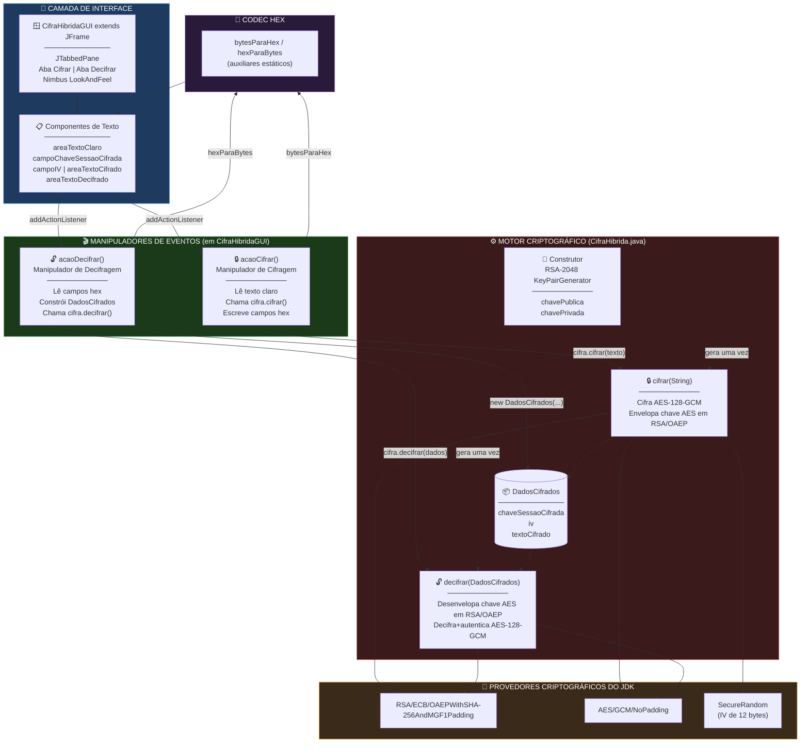
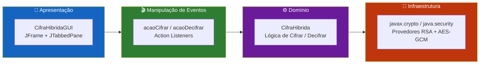
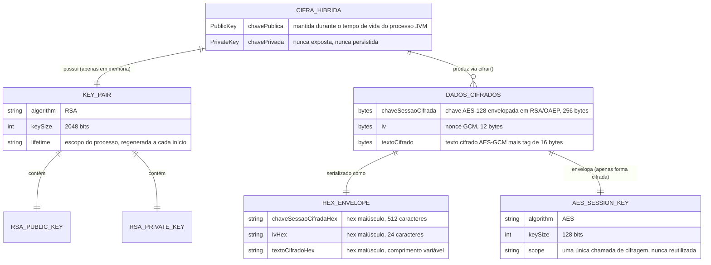
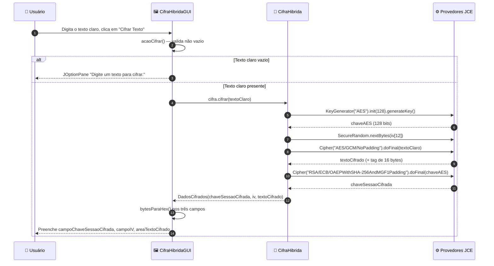
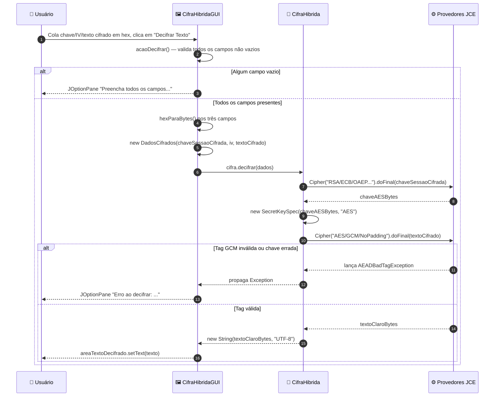
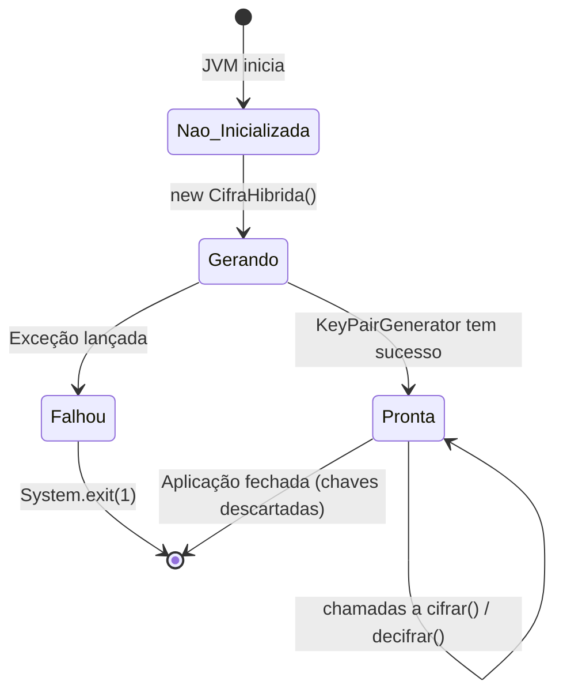
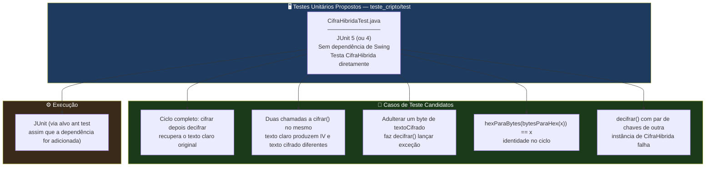

<div align="center">

**🌐 Choose Language / Selecione o Idioma / Elija el Idioma**

[](README.md)&nbsp;&nbsp;&nbsp;[](README_PT.md)&nbsp;&nbsp;&nbsp;[](README_ES.md)

</div>

---

<div align="center">

```
 ██████╗██╗███████╗██████╗  █████╗ 
██╔════╝██║██╔════╝██╔══██╗██╔══██╗
██║     ██║█████╗  ██████╔╝███████║
██║     ██║██╔══╝  ██╔══██╗██╔══██║
╚██████╗██║██║     ██║  ██║██║  ██║
 ╚═════╝╚═╝╚═╝     ╚═╝  ╚═╝╚═╝  ╚═╝
   Aplicação Desktop de Criptografia Híbrida RSA-2048 + AES-128-GCM
```

---

[](https://openjdk.org/)
[](https://docs.oracle.com/javase/tutorial/uiswing/)
[](https://netbeans.apache.org/)
[]()
[]()
[]()
[]()

<br/>

> **Uma aplicação desktop nativa em Java Swing que demonstra criptografia híbrida**
> combinando troca de chaves assimétrica RSA-2048 com criptografia simétrica autenticada AES-128-GCM.

<br/>


-B71C1C?style=flat-square)

</div>

---

## 📑 Índice

<details>
<summary>▶️ <strong>Clique para expandir / recolher esta seção</strong></summary>

<table>
<tr>
<td valign="top" width="50%">

**🏗️ Sistema**
- [Visão Geral](#-visão-geral)
- [Arquitetura do Sistema](#-arquitetura-do-sistema)
- [Stack Tecnológica](#-stack-tecnológica)
- [Padrões de Projeto Aplicados](#-padrões-de-projeto-aplicados)
- [Estrutura do Projeto](#-estrutura-do-projeto)

**📦 Módulos**
- [CifraHibrida — Motor Criptográfico](#-cifrahibrida--motor-criptográfico-híbrido)
- [DadosCifrados — Contêiner de Ciphertext](#-dadoscifrados--contêiner-de-dados-cifrados)
- [CifraHibridaGUI — Interface Swing](#-cifrahibridagui--interface-swing)
- [Auxiliares de Codificação Hex](#-auxiliares-de-codificação-hex)

</td>
<td valign="top" width="50%">

**💼 Negócio**
- [Regras de Negócio](#-regras-de-negócio)
- [Requisitos Funcionais](#-requisitos-funcionais)
- [Requisitos Não Funcionais](#-requisitos-não-funcionais)

**📐 Design**
- [Modelo de Dados](#-modelo-de-dados)
- [Fluxos do Sistema](#-fluxos-do-sistema)
- [Fluxo de Cifragem](#fluxo-de-cifragem)
- [Fluxo de Decifragem](#fluxo-de-decifragem)
- [Fluxo de Eventos da GUI](#fluxo-de-eventos-da-gui)

**🔐 Segurança & Operações**
- [Segurança](#-segurança)
- [Instalação & Execução](#-instalação--execução)
- [Testes Automatizados](#-testes-automatizados)
- [Métricas & Monitoramento](#-métricas--monitoramento)
- [Limitações Conhecidas](#-limitações-conhecidas)

</td>
</tr>
</table>

---

</details>

## 🌟 Visão Geral

<details>
<summary>▶️ <strong>Clique para expandir / recolher esta seção</strong></summary>

**CifraHibrida** (`teste_cripto`) é uma pequena aplicação desktop Java Swing, autocontida, que demonstra o padrão de **criptografia híbrida** usado por protocolos do mundo real como TLS e PGP: uma **cifra simétrica** rápida (AES-128 em modo GCM) protege a mensagem em si, enquanto uma **cifra assimétrica** mais lenta, porém adequada para troca de chaves (RSA-2048), protege a chave simétrica de uso único. Todo identificador no código-fonte, de nomes de classes a nomes de variáveis, está em português, refletindo a origem do projeto como um exercício educacional de criptografia.

A aplicação possui exatamente duas classes. `CifraHibrida.java` é o motor criptográfico: ele gera um par de chaves RSA-2048 na construção, expõe um método `cifrar()` que produz um texto cifrado com AES e uma chave de sessão AES envolta (wrapped) em RSA, e um método `decifrar()` que reverte o processo. `CifraHibridaGUI.java` é uma interface Swing baseada em `JFrame` com duas abas, "Cifrar" e "Decifrar", que permite ao usuário digitar um texto claro, cifrá-lo e ver os três arrays de bytes resultantes (chave de sessão, IV, texto cifrado) renderizados como texto hexadecimal, ou colar valores hexadecimais de volta para decifrá-los.

Não há **banco de dados, socket de rede ou persistência em arquivo** em nenhum lugar do código. O par de chaves RSA vive apenas na memória do objeto `CifraHibrida` durante o tempo de vida do processo da JVM em execução; fechar a aplicação descarta-o de forma irrecuperável. Essa é uma escolha de design deliberada, embora não declarada explicitamente no código, inerente ao pequeno escopo didático do projeto, e é documentada honestamente ao longo deste README, particularmente em [Segurança](#-segurança) e [Limitações Conhecidas](#-limitações-conhecidas).

### 🎯 Objetivos do Sistema

| Objetivo | Descrição |
|-----------|-------------|
| 🔑 **Geração de Par de Chaves** | Gerar um novo par de chaves RSA-2048 a cada início da aplicação, via `KeyPairGenerator` |
| 🔒 **Criptografia Simétrica** | Cifrar texto claro UTF-8 arbitrário com uma chave AES de 128 bits recém-gerada em modo GCM |
| 🎁 **Envelopamento de Chave** | Cifrar (envelopar) a chave AES de uso único com a chave pública RSA usando padding OAEP |
| 🔓 **Ciclo de Decifragem** | Desenvelopar a chave AES com a chave privada RSA, depois decifrar e autenticar o texto cifrado |
| 🔡 **Transporte Legível por Humanos** | Codificar todo array de bytes criptográfico (chave, IV, texto cifrado) como texto hexadecimal maiúsculo |
| 🖼️ **Demonstração Interativa** | Fornecer uma GUI Swing com duas abas para que o usuário cifre e decifre sem escrever código |
| 🎨 **Aparência Nativa** | Usar o `LookAndFeel` Nimbus para uma aparência desktop moderna |
| 📦 **Zero Dependências Externas** | Depender exclusivamente das APIs `java.security` e `javax.crypto` embutidas no JDK |

---

</details>

## 🏗️ Arquitetura do Sistema

<details>
<summary>▶️ <strong>Clique para expandir / recolher esta seção</strong></summary>

### Diagrama de Módulos



### Camadas de Arquitetura



---

</details>

## 🛠️ Stack Tecnológica

<details>
<summary>▶️ <strong>Clique para expandir / recolher esta seção</strong></summary>

<table>
<thead>
<tr>
<th>Camada</th>
<th>Tecnologia</th>
<th>Versão</th>
<th>Finalidade</th>
</tr>
</thead>
<tbody>
<tr>
<td rowspan="2"><strong>🧠 Linguagem</strong></td>
<td>Java</td>
<td>17 (<code>javac.source</code> / <code>javac.target</code>)</td>
<td>Nível de código-fonte e bytecode de destino da aplicação</td>
</tr>
<tr>
<td>UTF-8</td>
<td><code>source.encoding</code></td>
<td>Codificação dos arquivos-fonte e das strings de texto claro</td>
</tr>
<tr>
<td rowspan="2"><strong>🖼️ Toolkit de UI</strong></td>
<td>Java Swing</td>
<td>Embutido no JDK</td>
<td><code>JFrame</code>, <code>JTabbedPane</code>, <code>JTextArea</code>, <code>JTextField</code>, <code>JButton</code></td>
</tr>
<tr>
<td>Nimbus LookAndFeel</td>
<td>Embutido no JDK</td>
<td>Tema moderno multiplataforma aplicado via <code>UIManager</code></td>
</tr>
<tr>
<td rowspan="2"><strong>🔐 Criptografia Assimétrica</strong></td>
<td>RSA</td>
<td>2048 bits</td>
<td><code>KeyPairGenerator</code> / <code>Cipher</code> — envelopamento da chave de sessão</td>
</tr>
<tr>
<td>Padding OAEP</td>
<td>SHA-256 + MGF1</td>
<td>Transformação <code>RSA/ECB/OAEPWithSHA-256AndMGF1Padding</code></td>
</tr>
<tr>
<td rowspan="2"><strong>🔒 Criptografia Simétrica</strong></td>
<td>AES</td>
<td>128 bits</td>
<td><code>KeyGenerator</code> / <code>Cipher</code> — cifragem da mensagem</td>
</tr>
<tr>
<td>Modo GCM</td>
<td>Tag de autenticação de 128 bits, IV de 12 bytes</td>
<td><code>AES/GCM/NoPadding</code> — confidencialidade + integridade em uma única passagem</td>
</tr>
<tr>
<td><strong>🎲 Aleatoriedade</strong></td>
<td>SecureRandom</td>
<td>Embutido no JDK</td>
<td>Geração criptograficamente segura do IV</td>
</tr>
<tr>
<td><strong>🔡 Codificação</strong></td>
<td>Codec Hex Personalizado</td>
<td>—</td>
<td>Auxiliares estáticos <code>bytesParaHex</code> / <code>hexParaBytes</code>, sem biblioteca externa</td>
</tr>
<tr>
<td rowspan="2"><strong>🔧 Build</strong></td>
<td>Apache Ant</td>
<td>Gerado pelo NetBeans (<code>build-impl.xml</code>)</td>
<td>Ciclo de vida de compilar, executar, empacotar (jar), testar, limpar</td>
</tr>
<tr>
<td>Modelo de Projeto NetBeans</td>
<td><code>org.netbeans.modules.java.j2seproject</code></td>
<td>Metadados de IDE em <code>nbproject/</code></td>
</tr>
</tbody>
</table>

---

</details>

## 🎨 Padrões de Projeto Aplicados

<details>
<summary>▶️ <strong>Clique para expandir / recolher esta seção</strong></summary>

| Padrão | Onde | Justificativa |
|---------|-------|-----------|
| 🎁 **Criptografia por Envelope (Sistema Híbrido)** | `CifraHibrida.cifrar()` / `decifrar()` | A mensagem em massa é cifrada com AES rápido; apenas a pequena chave AES é cifrada com RSA lento |
| 📦 **Objeto de Valor / DTO** | `CifraHibrida.DadosCifrados` (classe interna estática) | Carregador imutável por convenção para os três componentes do texto cifrado, apenas com getters |
| 🧩 **Classe Interna Estática** | `DadosCifrados` declarada dentro de `CifraHibrida` | Agrupa o formato do texto cifrado com o motor que o produz e consome |
| 🧭 **Fachada (Facade)** | `cifrar(String)` / `decifrar(DadosCifrados)` | Dois métodos de chamada única escondem geração de chave, geração de IV, configuração de parâmetros GCM e envelopamento RSA |
| 🎬 **Observer / Callback (Listener Lambda)** | `botaoCifrar.addActionListener(e -> acaoCifrar())` | Reação orientada a eventos Swing a cliques de botão |
| 🔡 **Codec / Tradutor** | `bytesParaHex` / `hexParaBytes` | Converte entre o domínio binário de `javax.crypto` e o domínio textual de `JTextArea` |
| 🚦 **Cláusula de Guarda** | `if (textoClaro == null \|\| textoClaro.isEmpty())` em `acaoCifrar()` | O retorno antecipado mantém o caminho feliz do manipulador simples |
| 🏗️ **Fábrica Estática via Construtor** | `new CifraHibrida()` lança `Exception` verificada | A geração do par de chaves é inseparável da construção do objeto, forçando os chamadores a tratar a falha imediatamente |

---

</details>

## 📁 Estrutura do Projeto

<details>
<summary>▶️ <strong>Clique para expandir / recolher esta seção</strong></summary>

```
programa_criptografico_chaves/
│
├── 📄 README.md                          # 🇺🇸 English (primary)
├── 📄 README_PT.md                       # 🇧🇷 Português (este arquivo)
├── 📄 README_ES.md                       # 🇪🇸 Español
├── 📄 .gitignore                         # Regras de exclusão (artefatos build/dist do NetBeans)
│
└── 📂 teste_cripto/                      # Projeto NetBeans Ant Java SE (nome real do projeto)
    │
    ├── 📄 build.xml                      # Ponto de entrada do Ant, importa nbproject/build-impl.xml
    ├── 📄 manifest.mf                    # Stub de manifest do JAR (Main-Class injetado pelo build)
    │
    ├── 📂 src/
    │   ├── 📄 CifraHibrida.java          # ★ Motor criptográfico — geração de chaves, cifrar(), decifrar() (113 linhas)
    │   └── 📄 CifraHibridaGUI.java       # ★ GUI Swing — JFrame, abas, manipuladores de eventos (249 linhas)
    │
    ├── 📂 nbproject/
    │   ├── 📄 project.xml                # Tipo de projeto NetBeans + declaração das raízes de src/test
    │   ├── 📄 project.properties         # javac.source=17, main.class, dist.jar, run.classpath, ...
    │   ├── 📄 build-impl.xml             # Implementação Ant gerada (compile/run/jar/test/clean)
    │   ├── 📄 genfiles.properties         # Controle interno de geração do NetBeans
    │   └── 📂 private/                   # Configurações locais do NetBeans, específicas da máquina (não portáveis)
    │
    ├── 📂 build/                         # 📤 Saída de classes compiladas (criada por `ant compile`, descartável)
    │
    └── 📂 dist/                          # 📤 Saída de distribuição (criada por `ant jar`)
        ├── 📄 README.TXT                 # Texto padrão gerado pelo NetBeans sobre a pasta dist
        └── 📄 teste_cripto.jar           # JAR executável (Main-Class: CifraHibridaGUI)
```

> [!NOTE]
> `build/` e `dist/` são artefatos gerados, não código-fonte. São recriados por `ant compile` / `ant jar` e podem ser apagados com segurança via `ant clean`. Não existe pasta `test/`, apesar de `nbproject/project.properties` declarar `test.src.dir=test` — o diretório nunca foi criado, portanto não há testes automatizados ainda. Ver [Testes Automatizados](#-testes-automatizados).

---

</details>

## 📦 Módulos do Sistema

<details>
<summary>▶️ <strong>Clique para expandir / recolher esta seção</strong></summary>

### 🔐 CifraHibrida — Motor Criptográfico Híbrido

`CifraHibrida.java` é todo o núcleo criptográfico da aplicação: 113 linhas, uma classe pública, uma classe interna estática, seis métodos ao todo (construtor, `cifrar`, `decifrar`, `getChaveSessaoCifrada`/`getIv`/`getTextoCifrado` no tipo interno, mais os dois auxiliares hex estáticos).

| Responsabilidade | Implementação |
|-----------------|-----------------|
| Geração do par de chaves | Construtor: `KeyPairGenerator.getInstance("RSA")`, `initialize(2048)`, `generateKeyPair()` |
| Estado mantido | `private PublicKey chavePublica;` `private PrivateKey chavePrivada;` — nunca exposto via getters |
| Ponto de entrada de cifragem | `public DadosCifrados cifrar(String textoClaro) throws Exception` |
| Ponto de entrada de decifragem | `public String decifrar(DadosCifrados dados) throws Exception` |
| Modo de falha | Toda exceção criptográfica verificada (`NoSuchAlgorithmException`, `InvalidKeyException`, `BadPaddingException`, ...) se propaga como `Exception` ao chamador |

---

### 📦 DadosCifrados — Contêiner de Dados Cifrados

Uma `public static class` interna a `CifraHibrida`. É um carregador simples de três campos, imutável (os campos são `private` e definidos apenas no construtor; não existem setters).

| Campo | Tipo | Significado |
|-------|------|---------|
| `chaveSessaoCifrada` | `byte[]` | A chave de sessão AES de 128 bits, após cifragem RSA/OAEP com a chave pública |
| `iv` | `byte[]` | O vetor de inicialização GCM de 12 bytes (nonce), gerado a cada cifragem |
| `textoCifrado` | `byte[]` | O texto cifrado AES-GCM, com a tag de autenticação de 128 bits anexada pelo provedor JCE |

Acessados via `getChaveSessaoCifrada()`, `getIv()`, `getTextoCifrado()`. `CifraHibridaGUI` também constrói um `DadosCifrados` diretamente via seu construtor público ao reconstituir a entrada hex de volta em bytes para decifragem.

---

### 🖼️ CifraHibridaGUI — Interface Swing

`CifraHibridaGUI.java` (249 linhas) estende `JFrame` e é dona de toda a camada de apresentação, além dos dois manipuladores de eventos que conectam a UI a `CifraHibrida`.

| Responsabilidade | Implementação |
|-----------------|-----------------|
| Configuração da janela | O construtor chama `super("Cifra Híbrida - Interface Moderna")`, instancia `CifraHibrida`, chama `inicializarComponentes()` |
| Look and feel | Itera `UIManager.getInstalledLookAndFeels()`, aplica `"Nimbus"` se encontrado, tanto no construtor quanto em `main()` |
| Layout | `JTabbedPane` com duas abas: `"Cifrar"` (`painelCifrar`) e `"Decifrar"` (`painelDecifrar`), cada uma um `BorderLayout` de sub-painéis com título |
| Campos da aba Cifrar | `areaTextoClaro` (entrada), `campoChaveSessaoCifrada`, `campoIV`, `areaTextoCifrado` (saídas somente leitura) |
| Campos da aba Decifrar | `areaChaveSessaoCifrada`, `areaIV`, `areaTextoCifradoDecifrar` (entradas), `areaTextoDecifrado` (saída somente leitura) |
| Ponto de entrada | `public static void main(String[] args)` — aplica Nimbus, depois `SwingUtilities.invokeLater(() -> new CifraHibridaGUI().setVisible(true))` |

---

### 🎬 Manipuladores de Eventos

| Manipulador | Disparo | Comportamento |
|---------|---------|-----------|
| `acaoCifrar()` | Clique em `botaoCifrar` ("Cifrar Texto") | Valida texto claro não vazio, chama `cifra.cifrar(textoClaro)`, escreve os três resultados como hex nos campos da aba de cifragem |
| `acaoDecifrar()` | Clique em `botaoDecifrar` ("Decifrar Texto") | Valida que os três campos hex não estão vazios, converte-os para bytes, constrói um `DadosCifrados`, chama `cifra.decifrar(dados)`, escreve o resultado em texto claro |

Ambos os manipuladores capturam `Exception` de forma ampla e exibem a mensagem via `JOptionPane.showMessageDialog`, de modo que uma string hex malformada ou uma tag GCM adulterada nunca derruba a thread da UI — produz um diálogo em vez disso.

---

### 🔡 Auxiliares de Codificação Hex

Dois métodos utilitários `public static` em `CifraHibrida`, usados tanto pela própria classe (indiretamente, através da GUI) quanto diretamente por `CifraHibridaGUI`.

| Método | Assinatura | Comportamento |
|--------|-----------|-----------|
| `bytesParaHex` | `static String bytesParaHex(byte[] bytes)` | Anexa `String.format("%02X", b)` para cada byte — maiúsculo, sem separadores |
| `hexParaBytes` | `static byte[] hexParaBytes(String hex)` | Analisa dois caracteres hex por byte de saída via `Character.digit(c, 16)`; assume entrada bem formada e de comprimento par |

> [!NOTE]
> `hexParaBytes` não realiza validação de comprimento ou de conjunto de caracteres. Uma string de comprimento ímpar ou não-hexadecimal lança uma exceção não verificada (`StringIndexOutOfBoundsException` ou um valor de byte malformado), capturada apenas pelo `catch (Exception ex)` amplo em `acaoDecifrar()`.

---

</details>

## 💼 Regras de Negócio

<details>
<summary>▶️ <strong>Clique para expandir / recolher esta seção</strong></summary>

### 🔑 Regras de Ciclo de Vida da Chave

| # | Regra | Aplicação |
|---|------|-------------|
| RN-01 | Existe exatamente um par de chaves RSA-2048 por instância de `CifraHibrida` em execução | Gerado uma única vez, no construtor, nunca regenerado |
| RN-02 | A chave privada nunca é serializada, exibida ou gravada em disco | Não existe getter para `chavePrivada`; nenhuma E/S de arquivo na classe |
| RN-03 | Um novo par de chaves é gerado a cada início da aplicação | `new CifraHibrida()` é chamado uma vez no construtor de `CifraHibridaGUI`, que por sua vez roda uma vez por processo |

### 🔒 Regras de Cifragem

| # | Regra | Aplicação |
|---|------|-------------|
| RN-04 | Toda cifragem usa uma chave AES-128 nova e de uso único | `KeyGenerator.getInstance("AES").init(128)` dentro de `cifrar()`, chamado a cada invocação |
| RN-05 | Toda cifragem usa um IV novo e aleatório de 12 bytes | `SecureRandom.nextBytes(iv)` dentro de `cifrar()` |
| RN-06 | A chave AES nunca é transmitida ou exibida em texto claro | Apenas `chaveSessaoCifrada` (a forma envelopada em RSA) sai de `cifrar()` |
| RN-07 | O texto claro deve ser codificável em UTF-8 | `textoClaro.getBytes("UTF-8")` — lança exceção em falha de codificação (praticamente nunca ocorre para `String`) |

### 🔓 Regras de Decifragem

| # | Regra | Aplicação |
|---|------|-------------|
| RN-08 | A decifragem requer os três componentes: chave envelopada, IV, texto cifrado | `decifrar(DadosCifrados)` recebe um único argumento composto; a GUI bloqueia o envio se algum campo hex estiver vazio |
| RN-09 | A tag de autenticação GCM deve ser válida, ou a decifragem falha | `Cipher.doFinal` lança `AEADBadTagException` (subtipo de `Exception`) em texto cifrado adulterado ou chave errada |
| RN-10 | A decifragem só é possível com a chave privada que corresponde à chave pública usada para envelopar a chave de sessão | RSA é assimétrico; um par de chaves incompatível falha em `cifraRSA.doFinal` |

---

</details>

## ✅ Requisitos Funcionais

<details>
<summary>▶️ <strong>Clique para expandir / recolher esta seção</strong></summary>

| ID | Requisito | Prioridade | Status |
|----|-------------|----------|--------|
| **RF-01** | O sistema deve gerar um par de chaves RSA-2048 na inicialização | 🔴 Alta | ✅ Implementado |
| **RF-02** | O sistema deve apresentar uma GUI com uma aba "Cifrar" e uma aba "Decifrar" | 🔴 Alta | ✅ Implementado |
| **RF-03** | O sistema deve aceitar texto claro arbitrário em uma área de texto multilinha | 🔴 Alta | ✅ Implementado |
| **RF-04** | O sistema deve rejeitar uma tentativa de cifragem com texto claro vazio, exibindo um diálogo | 🟡 Média | ✅ Implementado |
| **RF-05** | O sistema deve gerar uma chave AES-128 nova a cada cifragem | 🔴 Alta | ✅ Implementado |
| **RF-06** | O sistema deve gerar um IV de 12 bytes novo a cada cifragem | 🔴 Alta | ✅ Implementado |
| **RF-07** | O sistema deve cifrar o texto claro com AES/GCM/NoPadding | 🔴 Alta | ✅ Implementado |
| **RF-08** | O sistema deve envelopar a chave AES com RSA/ECB/OAEPWithSHA-256AndMGF1Padding | 🔴 Alta | ✅ Implementado |
| **RF-09** | O sistema deve exibir a chave envelopada, o IV e o texto cifrado como hexadecimal maiúsculo | 🔴 Alta | ✅ Implementado |
| **RF-10** | O sistema deve aceitar chave envelopada, IV e texto cifrado em hexadecimal para decifragem | 🔴 Alta | ✅ Implementado |
| **RF-11** | O sistema deve rejeitar uma tentativa de decifragem com qualquer campo vazio | 🟡 Média | ✅ Implementado |
| **RF-12** | O sistema deve desenvelopar a chave AES com a chave privada RSA | 🔴 Alta | ✅ Implementado |
| **RF-13** | O sistema deve decifrar e autenticar o texto cifrado com AES/GCM | 🔴 Alta | ✅ Implementado |
| **RF-14** | O sistema deve exibir o texto claro recuperado em uma área de texto somente leitura | 🔴 Alta | ✅ Implementado |
| **RF-15** | O sistema deve exibir um diálogo de erro em qualquer falha de cifragem | 🟡 Média | ✅ Implementado |
| **RF-16** | O sistema deve exibir um diálogo de erro em qualquer falha de decifragem (incluindo divergência de tag) | 🟡 Média | ✅ Implementado |
| **RF-17** | O sistema deve aplicar o Look and Feel Nimbus quando disponível | 🟢 Baixa | ✅ Implementado |
| **RF-18** | O sistema deve encerrar o processo se a geração do par de chaves falhar na inicialização | 🟡 Média | ✅ Implementado |
| **RF-19** | O sistema deve rodar como um JAR executável autônomo com `Main-Class: CifraHibridaGUI` | 🔴 Alta | ✅ Implementado |
| **RF-20** | O sistema deve persistir a chave de criptografia entre reinicializações da aplicação | 🟢 Baixa | ⬜ Planejado |
| **RF-21** | O sistema deve validar a entrada hexadecimal antes de tentar decodificá-la | 🟡 Média | ⬜ Planejado |
| **RF-22** | O sistema deve suportar salvar a saída cifrada em um arquivo | 🟢 Baixa | ⬜ Planejado |

---

</details>

## ⚡ Requisitos Não Funcionais

<details>
<summary>▶️ <strong>Clique para expandir / recolher esta seção</strong></summary>

| ID | Categoria | Requisito | Alvo |
|----|----------|-------------|--------|
| **RNF-01** | ⚡ Desempenho | Geração do par de chaves RSA-2048 na inicialização | < 500 ms em hardware comum |
| **RNF-02** | ⚡ Desempenho | Ciclo completo de cifrar/decifrar para texto curto | < 50 ms |
| **RNF-03** | 🔐 Segurança | Modo da cifra simétrica | Autenticado (AES-GCM), nunca ECB/CBC não autenticado para dados de mensagem |
| **RNF-04** | 🔐 Segurança | Esquema de padding assimétrico | OAEP (nunca raw/PKCS#1 v1.5) para o envelopamento da chave RSA |
| **RNF-05** | 🔐 Segurança | Fonte de aleatoriedade para chaves e IVs | `SecureRandom` / padrão JCE (CSPRNG), nunca `java.util.Random` |
| **RNF-06** | 📦 Tamanho | Tamanho do JAR executável | < 20 KB (sem dependências empacotadas) |
| **RNF-07** | 🧠 Memória | Heap residente para uma única instância de `CifraHibrida` | < 10 MB |
| **RNF-08** | 🎨 Usabilidade | Toda ação produz feedback visível (diálogo ou atualização de campo) | 100% dos cliques de botão |
| **RNF-09** | 🖥️ Portabilidade | Roda sem modificações em qualquer host JDK 17+ com display (Windows, Linux, macOS) | Sem código nativo, sem APIs específicas de plataforma |
| **RNF-10** | 🔧 Manutenibilidade | Zero dependências de terceiros | Apenas `javax.crypto`, `java.security`, `javax.swing` |
| **RNF-11** | 🧱 Reprodutibilidade do build | Build Ant determinístico via arquivos de projeto NetBeans | `ant clean jar` produz o mesmo layout de classes sempre |
| **RNF-12** | 🌍 Internacionalização | Rótulos da UI | Atualmente literais em português, não externalizados |
| **RNF-13** | ♿ Acessibilidade | Áreas de texto e campos legíveis por leitores de tela | Componentes Swing padrão (suporte básico JAAS/AT-SPI), sem renderização customizada |
| **RNF-14** | 🧪 Testabilidade | Lógica criptográfica separável da UI para testes unitários | `CifraHibrida` não tem dependência de Swing, portanto é testável de forma independente |

---

</details>

## 🗄️ Modelo de Dados

<details>
<summary>▶️ <strong>Clique para expandir / recolher esta seção</strong></summary>

> [!NOTE]
> Esta aplicação **não possui banco de dados nem persistência em arquivo**. Não há nada para modelar no sentido relacional ou documental tradicional. A seguir está o formato de objeto em memória mantido durante uma sessão, e o formato de transporte hexadecimal, que é a única coisa que efetivamente cruza uma fronteira de confiança (os campos de texto da GUI e, por extensão, a área de transferência ou anotações do usuário, caso ele copie os valores para fora).

### Diagrama Entidade-Relacionamento



### Formato de Objeto em Memória

| Campo | Dono | Tipo | Persistido? | Notas |
|-------|-------|------|-----------|-------|
| `chavePublica` | `CifraHibrida` | `java.security.PublicKey` | Não | Vive apenas na memória heap |
| `chavePrivada` | `CifraHibrida` | `java.security.PrivateKey` | Não | Nunca sai do objeto, sem getter |
| `chaveSessaoCifrada` | `DadosCifrados` | `byte[]` (256 bytes para RSA-2048/OAEP-SHA256) | Não | Envelopada em RSA, segura para exibir como hex |
| `iv` | `DadosCifrados` | `byte[]` (12 bytes) | Não | Nonce GCM, não é secreto mas nunca pode se repetir sob a mesma chave |
| `textoCifrado` | `DadosCifrados` | `byte[]` (comprimento do texto claro + tag de 16 bytes) | Não | Texto cifrado com tag de autenticação anexada pelo provedor JCE |

### Formato de Transporte Hexadecimal

| Campo | Bytes de Origem | Caracteres Hex | Forma de Exemplo |
|-------|--------------|-----------------|-----------------|
| Chave de Sessão Cifrada | 256 bytes (bloco de saída RSA-2048) | 512 caracteres hex | `A1B2C3...` (512 caracteres) |
| IV (Nonce) | 12 bytes | 24 caracteres hex | `9F00A1B2C3D4E5F607182930` |
| Texto Cifrado | comprimento do texto claro + 16 | 2×(N+16) caracteres hex | variável, cresce com o tamanho da mensagem |

Não existe prefixo de comprimento, delimitador, ou formato de envelope unindo essas três strings hex além dos três campos Swing separados; o usuário deve copiar as três corretamente e na ordem certa para que `acaoDecifrar()` funcione.

---

</details>

## 🔄 Fluxos do Sistema

<details>
<summary>▶️ <strong>Clique para expandir / recolher esta seção</strong></summary>

### Fluxo de Cifragem



### Fluxo de Decifragem



### Fluxo de Eventos da GUI

```mermaid
flowchart TD
    START([Início da aplicação]) --> MAIN[main: aplica Nimbus,\ninvokeLater]
    MAIN --> CTOR[Construtor de CifraHibridaGUI]
    CTOR --> KEYPAIR{CifraHibrida()\ngeração do par de chaves}
    KEYPAIR -- Exceção --> FATAL[showMessageDialog +\nSystem.exit 1]
    KEYPAIR -- OK --> INIT[inicializarComponentes\nconstrói abas e campos]
    INIT --> READY([Janela visível, ociosa])
    READY -- clique Cifrar --> ENC[acaoCifrar]
    READY -- clique Decifrar --> DEC[acaoDecifrar]
    ENC --> READY
    DEC --> READY

    style START fill:#1565C0,color:#fff
    style READY fill:#2E7D32,color:#fff
    style FATAL fill:#B71C1C,color:#fff
```

### Máquina de Estados do Par de Chaves



---

</details>

## 🔐 Segurança

<details>
<summary>▶️ <strong>Clique para expandir / recolher esta seção</strong></summary>

### Controles Implementados

| Controle | Implementação | Efeito |
|---------|---------------|--------|
| 🔑 **Tamanho de chave assimétrica forte** | RSA `initialize(2048)` | Atende ao mínimo atualmente recomendado (2026) para robustez RSA |
| 🎁 **Padding OAEP, não PKCS#1 v1.5** | `RSA/ECB/OAEPWithSHA-256AndMGF1Padding` | Resistente a ataques de oráculo de padding no estilo Bleichenbacher, que afetam o PKCS#1 v1.5 bruto |
| 🔒 **Criptografia simétrica autenticada** | `AES/GCM/NoPadding`, tag de 128 bits | Confidencialidade e integridade/autenticidade em uma única primitiva; adulteração é detectada, não decifrada silenciosamente |
| 🎲 **IV novo a cada cifragem** | `SecureRandom` gera um novo IV de 12 bytes dentro de cada chamada a `cifrar()` | Evita o modo de falha catastrófico de reuso de nonce do AES-GCM |
| 🎯 **Chave de sessão nova a cada cifragem** | Nova `SecretKey` AES gerada dentro de cada chamada a `cifrar()` | Limita o raio de impacto de qualquer comprometimento de chave a uma única mensagem |
| 🚫 **Chave privada nunca exposta** | Não existe getter para `chavePrivada`; nunca é registrada em log, impressa ou serializada | Não pode vazar através da API pública do objeto |
| 🌐 **Sem exposição de rede** | Nenhum socket, nenhum cliente HTTP, nenhuma porta em escuta em qualquer lugar do código | Texto cifrado, chaves e texto claro nunca saem do processo local |
| ✅ **Exceções expostas, não engolidas** | Ambos os manipuladores capturam e exibem `Exception`, nunca ignoram silenciosamente uma falha criptográfica | Um texto cifrado adulterado ou corrompido produz um erro visível, não uma decifragem "bem-sucedida" incorreta |

### Limitações de Segurança Conhecidas

> [!WARNING]
> Este é um projeto didático/de demonstração. As limitações abaixo são inerentes ao seu escopo atual e devem ser entendidas, e a maioria delas deve ser resolvida, antes de qualquer adaptação para um contexto de produção ou de dados sensíveis.

| Limitação | Risco | Caminho de Mitigação |
|------------|------|-----------------|
| 🗝️ **O par de chaves RSA nunca é persistido** | O texto cifrado em uma sessão fica **permanentemente indecifrável** após o fechamento da aplicação, a menos que o usuário tenha salvo manualmente a chave envelopada em hex junto com uma chave privada exportada separadamente (o que a GUI não oferece forma de fazer) | Adicionar exportação/importação explícita de chaves (ex.: arquivos PEM PKCS#8/X.509, opcionalmente cifrados com senha) |
| 🔄 **Um novo par de chaves é gerado a cada início** | Dados cifrados na sessão A nunca podem ser decifrados na sessão B, mesmo pelo mesmo usuário na mesma máquina, porque `chavePrivada` é regenerada do zero | Carregar um par de chaves persistido na inicialização, em vez de sempre chamar `generateKeyPair()` |
| 🕵️ **Sem autenticação da chave pública RSA** | A GUI nunca exibe uma impressão digital (fingerprint) de `chavePublica`; o usuário não tem como verificar contra qual par de chaves um determinado texto cifrado foi cifrado, caso múltiplas sessões ou máquinas estejam envolvidas | Exibir uma impressão digital SHA-256 da chave pública na UI, para verificação fora de banda |
| 🧪 **Sem validação da entrada hex antes da decodificação** | `hexParaBytes` em entrada malformada (comprimento ímpar, caracteres não hexadecimais) lança uma exceção não verificada, capturada apenas pelo `catch (Exception ex)` amplo em `acaoDecifrar()` | Validar com uma regex (`^[0-9A-Fa-f]+$` e comprimento par) antes de chamar `hexParaBytes`, com uma mensagem específica ao usuário |
| 📋 **Texto claro e cifrado passam por `JTextArea` / área de transferência do Swing** | Se o usuário copiar a saída hex para compartilhá-la, a chave AES envelopada e o texto cifrado podem ser retidos no histórico da área de transferência do SO ou colados acidentalmente em outro lugar | Documentar isso em um aviso na UI; evitar esse padrão para qualquer segredo real |
| 🧵 **Sem zeragem de memória do material de chave** | Os `byte[]` que sustentam a chave AES e os componentes da chave privada RSA são deixados para o coletor de lixo, não são explicitamente apagados | Usar `Arrays.fill(sensitiveArray, (byte) 0)` após o uso, onde a superfície da API permitir |
| ⚖️ **A nomenclatura "RSA/ECB/..." é uma convenção Java/JCE, não um ECB literal de cifra de bloco** | A palavra "ECB" na string de transformação pode levar um leitor a pensar que o RSA está sendo usado no modo de bloco ECB; na JCE, "ECB" aqui é um espaço reservado obrigatório, mas sem significado, para o campo de modo do RSA, e o OAEP é o padding real e seguro em vigor | Nenhuma correção técnica necessária; documentar a nomenclatura claramente (como feito aqui) para não confundir com AES-ECB, que é genuinamente inseguro |
| 🧾 **Sem log ou trilha de auditoria** | Nenhum registro de quando a cifragem/decifragem ocorreu, por quem, ou quantas tentativas falharam | Fora do escopo para uma demo desktop de usuário único; importaria em uma implantação multiusuário |

---

</details>

## 🚀 Instalação & Execução

<details>
<summary>▶️ <strong>Clique para expandir / recolher esta seção</strong></summary>

### Pré-requisitos

```bash
# Java Development Kit 17 ou mais recente (javac.source/target = 17)
java -version         # esperado 17+
javac -version        # esperado 17+

# Apache Ant (empacotado com o NetBeans, ou instale separadamente)
ant -version           # esperado Ant 1.9+

# Opcional: Apache NetBeans IDE para uma experiência gráfica de build/execução/depuração
```

### Build

```bash
# Navegue até o projeto NetBeans real (não a raiz do repositório)
cd teste_cripto

# Compila todas as fontes em build/classes
ant compile

# Constrói o projeto completo (compila + copia recursos)
ant

# Empacota o JAR executável em dist/teste_cripto.jar
ant jar

# Remove todos os artefatos de build e dist gerados
ant clean
```

### Execução

```bash
# Opção A — executar via Ant (compila se necessário, depois lança a GUI)
cd teste_cripto
ant run

# Opção B — executar o JAR empacotado diretamente
java -jar dist/teste_cripto.jar

# Opção C — executar a classe compilada diretamente (após `ant compile`)
java -cp build/classes CifraHibridaGUI
```

**Uso na aplicação**

1. Inicie o **CifraHibrida** — a aba "Cifrar" é exibida primeiro, e um par de chaves RSA-2048 é gerado silenciosamente em segundo plano.
2. Digite qualquer texto na caixa "Texto Claro" e clique em **Cifrar Texto**.
3. Os campos "Chave de Sessão Cifrada", "IV (Nonce)" e "Texto Cifrado" são preenchidos com valores hexadecimais.
4. Vá para a aba "Decifrar" e cole esses mesmos três valores hex nos campos correspondentes.
5. Clique em **Decifrar Texto** — o texto claro original reaparece em "Texto Decifrado".
6. Fechar a janela encerra o processo e descarta o par de chaves RSA; os valores só decifram dentro da mesma sessão em execução.

### Alvos do Ant

| Alvo | Finalidade |
|--------|---------|
| `ant compile` | Compila `src/*.java` em `build/classes` |
| `ant` (padrão) | Constrói o projeto (equivalente a `ant compile`) |
| `ant jar` | Produz `dist/teste_cripto.jar` com `Main-Class: CifraHibridaGUI` |
| `ant run` | Compila (se necessário) e lança `CifraHibridaGUI` |
| `ant test` | Executa o conjunto de fontes `test/` (atualmente ausente) — ver [Testes Automatizados](#-testes-automatizados) |
| `ant clean` | Apaga os diretórios `build/` e `dist/` |
| `ant javadoc` | Gera documentação de API em `dist/javadoc/` |
| `ant debug` | Lança sob uma conexão de depurador (`nbproject/build-impl.xml`) |

### Configuração do Build

| Configuração | Valor | Declarado em |
|---------|-------|-------------|
| Nome do projeto | `teste_cripto` | `build.xml`, `nbproject/project.xml` |
| `main.class` | `CifraHibridaGUI` | `nbproject/project.properties` |
| `javac.source` / `javac.target` | `17` / `17` | `nbproject/project.properties` |
| `source.encoding` | `UTF-8` | `nbproject/project.properties` |
| `src.dir` | `src` | `nbproject/project.properties` |
| `test.src.dir` | `test` (declarado, pasta ausente) | `nbproject/project.properties` |
| `dist.jar` | `dist/teste_cripto.jar` | `nbproject/project.properties` |
| `manifest.file` | `manifest.mf` | `nbproject/project.properties` |
| `javac.classpath` | *(vazio)* — zero dependências externas | `nbproject/project.properties` |

---

</details>

## 🧪 Testes Automatizados

<details>
<summary>▶️ <strong>Clique para expandir / recolher esta seção</strong></summary>

> [!IMPORTANT]
> **Nenhum teste automatizado existe atualmente neste projeto.** `nbproject/project.properties` declara `test.src.dir=test` e o `build-impl.xml` gerado pelo Ant expõe um alvo `ant test`, mas o diretório `teste_cripto/test/` nunca foi criado. Executar `ant test` hoje não executa nenhum teste, pois não há nada para compilar ou rodar. Isso é declarado explicitamente, conforme o padrão de documentação do projeto, junto com uma proposta de suíte abaixo.

### Arquitetura de Testes (Proposta)



| Conjunto de fontes | Localização | Status |
|------------|----------|--------|
| Testes unitários | `teste_cripto/test/CifraHibridaTest.java` | ⬜ Ausente — proposto |
| Alvo Ant | `ant test` (gerado por `build-impl.xml`) | ⚠️ Conectado, mas sem nada para executar |

### Executando os Testes

```bash
# Uma vez que um diretório test/ e uma dependência JUnit sejam adicionados a
# nbproject/project.properties (javac.test.classpath):
cd teste_cripto
ant test

# Local do relatório HTML (uma vez populado):
# build/test/results/
```

### Checklist de Aceitação Manual

| # | Cenário | Resultado esperado |
|---|----------|-----------------|
| 1 | Iniciar a aplicação | A janela abre na aba "Cifrar", nenhum diálogo aparece |
| 2 | Clicar em "Cifrar Texto" com a caixa de texto claro vazia | Diálogo: "Digite um texto para cifrar." |
| 3 | Digitar "Hello World" e clicar em "Cifrar Texto" | Os três campos hex são preenchidos, não vazios |
| 4 | Cifrar o mesmo texto claro duas vezes | Os dois valores hex resultantes de IV e texto cifrado diferem |
| 5 | Ir para "Decifrar", colar os três valores hex, clicar em "Decifrar Texto" | "Texto Decifrado" mostra "Hello World" exatamente |
| 6 | Clicar em "Decifrar Texto" com algum campo vazio | Diálogo: "Preencha todos os campos com os dados cifrados." |
| 7 | Alterar um caractere hex do texto cifrado antes de decifrar | Diálogo: "Erro ao decifrar: ..." (divergência de tag GCM) |
| 8 | Colar uma string de comprimento ímpar ou não-hex em qualquer campo de decifragem | Diálogo: "Erro ao decifrar: ..." (falha na análise hex) |
| 9 | Fechar e reiniciar a aplicação, depois colar valores de antes do reinício | A decifragem falha — o par de chaves RSA foi regenerado |
| 10 | Cifrar um parágrafo muito longo (vários KB) | O hex do texto cifrado é renderizado e quebrado corretamente na área de texto rolável |

---

</details>

## 📊 Métricas & Monitoramento

<details>
<summary>▶️ <strong>Clique para expandir / recolher esta seção</strong></summary>

### Métricas do Código

| Métrica | Valor |
|--------|-------|
| Arquivos-fonte Java | 2 (`CifraHibrida.java`, `CifraHibridaGUI.java`) |
| Linhas de Java (`CifraHibrida.java`) | 113 |
| Linhas de Java (`CifraHibridaGUI.java`) | 249 |
| Classes públicas | 2 (mais 1 classe interna estática, `DadosCifrados`) |
| Dependências externas em runtime | 0 (`javac.classpath` está vazio) |
| Tamanho da chave RSA | 2048 bits |
| Tamanho da chave AES | 128 bits |
| Tamanho do IV GCM | 12 bytes (96 bits) |
| Tamanho da tag de autenticação GCM | 128 bits |
| Arquivos de teste automatizado | 0 |

### Sinais em Tempo de Execução

| Sinal | Origem | Onde observar |
|--------|--------|------------------|
| Falha na geração do par de chaves | `catch (Exception e)` no construtor de `CifraHibridaGUI` | Stack trace no console + diálogo `JOptionPane`, seguido de `System.exit(1)` |
| Falha de cifragem | `catch (Exception ex)` em `acaoCifrar()` | Diálogo `JOptionPane`: "Erro ao cifrar: ..." |
| Falha de decifragem (incluindo divergência de tag GCM) | `catch (Exception ex)` em `acaoDecifrar()` | Diálogo `JOptionPane`: "Erro ao decifrar: ..." |
| Nimbus Look and Feel indisponível | `catch (Exception ex)` ao redor de `UIManager.setLookAndFeel` | Apenas stack trace no console; a UI recorre silenciosamente ao L&F padrão |

### Comandos de Diagnóstico Úteis

```bash
# Confirma que a versão do JDK corresponde ao javac.source/target do projeto
java -version

# Inspeciona o manifest do JAR construído para conferir o Main-Class injetado
unzip -p teste_cripto/dist/teste_cripto.jar META-INF/MANIFEST.MF

# Lista os Look and Feels instalados disponíveis nesta JVM (ajuda a confirmar a presença do Nimbus)
java -XshowSettings:properties -version 2>&1 | grep -i laf

# Executa com carregamento de classes verboso para confirmar que nenhum JAR externo é carregado
java -verbose:class -jar teste_cripto/dist/teste_cripto.jar
```

### Modos de Falha Padronizados

| Condição | Exceção Java | Mensagem Visível ao Usuário |
|-----------|-----------------|------------------------|
| Geração do par de chaves RSA falha na inicialização | `NoSuchAlgorithmException` (inesperado em um JDK padrão) | "Erro ao iniciar o sistema de criptografia: ..." + processo encerra |
| Texto claro vazio ao cifrar | *(tratado antes de qualquer exceção)* | "Digite um texto para cifrar." |
| Campo vazio ao decifrar | *(tratado antes de qualquer exceção)* | "Preencha todos os campos com os dados cifrados." |
| Entrada hex malformada | `StringIndexOutOfBoundsException` ou similar | "Erro ao decifrar: ..." |
| Texto cifrado adulterado ou chave errada | `AEADBadTagException` | "Erro ao decifrar: ..." |
| Falha ao desenvelopar RSA (par de chaves errado) | `BadPaddingException` | "Erro ao decifrar: ..." |

---

</details>

## ⚠️ Limitações Conhecidas

<details>
<summary>▶️ <strong>Clique para expandir / recolher esta seção</strong></summary>

> [!IMPORTANT]
> Esta aplicação foi construída como uma demonstração educacional de criptografia híbrida RSA/AES e construção de UI desktop em Java Swing. Não está fortalecida para uso em produção ou com múltiplos usuários.

| Categoria | Problema | Status |
|----------|-------|--------|
| 🔑 **Sem persistência de chave** | O par de chaves RSA existe apenas na memória do processo e é perdido ao sair | ⚠️ Aberto — adicionar exportação/importação de arquivo PKCS#8/X.509 |
| 🔄 **Sem decifragem entre sessões** | O texto cifrado de uma execução não pode ser decifrado em uma execução posterior, por design | ➕ Intencional (escopo atual), mas ver mitigação em Segurança |
| 🧪 **Sem testes automatizados** | Diretório `test/` declarado, mas nunca criado | ⚠️ Aberto — ver [Testes Automatizados](#-testes-automatizados) para uma suíte proposta |
| 🧾 **Sem validação da entrada hex** | Hex malformado chega a `hexParaBytes` sem verificação, produzindo um erro genérico | ⚠️ Aberto — adicionar pré-validação por regex com mensagem específica |
| 🌍 **Strings da UI fixas em português** | Todos os rótulos e diálogos são literais em português dentro de `CifraHibridaGUI.java` | ⚠️ Aberto — externalizar para um `ResourceBundle` para i18n |
| 🧵 **Sem zeragem explícita do material de chave** | Os arrays de bytes que armazenam bytes de chave AES/RSA são deixados para o GC | ⚠️ Aberto — `Arrays.fill(..., (byte) 0)` onde a API da JCE permitir |
| 🔍 **Sem exibição de impressão digital da chave pública** | O usuário não consegue verificar a qual par de chaves um texto cifrado pertence | ⚠️ Aberto — exibir impressão digital SHA-256 na UI |
| 📋 **Exposição pela área de transferência** | Os campos hex são copiáveis, então segredos podem parar no histórico da área de transferência | ➕ Intencional (necessário para o fluxo de demonstração), documentar como ressalva |
| 🖥️ **Design de janela única, usuário único** | Sem suporte a múltiplos documentos, múltiplos usuários, ou troca de sessão | ➕ Intencional — corresponde ao escopo didático do projeto |
| 🔧 **Sem dependência Ant para um framework de testes** | `javac.classpath` está vazio, então o JUnit ainda não está conectado ao `ant test` | ⚠️ Aberto — adicionar referência ao JAR do JUnit para habilitar a suíte de testes proposta |

> [!TIP]
> A melhoria de maior valor é adicionar **persistência do par de chaves RSA** (exportar o par de chaves para arquivos PEM PKCS#8/X.509 sob demanda, e carregá-los na inicialização se presentes). Essa única mudança remove o comportamento mais confuso enfrentado por novos usuários — "por que não consigo decifrar o que acabei de cifrar depois de reiniciar?" — e é um pré-requisito natural para adicionar posteriormente validação de entrada hex e exibição de impressão digital da chave pública.

</details>

---

<div align="center">

---

### 🔐 CifraHibrida

*Cifra rápida para a mensagem, cifra forte para a chave*

[](https://openjdk.org/)
[]()
[]()
[]()
[](https://docs.oracle.com/javase/tutorial/uiswing/)

<br/>

```
"O envelope protege a carta,
 e uma fechadura mais forte protege o envelope."
```

</div>
